# Skúška Multimediálne signály v komunikačných sieťach

## Prednáška č. 1

## Spracovanie multimediálnych signálov

### Základné pojmy:
- Signál
    - je to elektrický signál 
    - je to zdroj informácie
    - signál je opísaný reálnou funkciou času
    - ľubovoľný fyzikálny proces, ktorého stav sa v čase mení v súlade s prenášanou informáciou podľa vopred definovaných pravidiel
    - počas svojej existencie môže signál vyvolať určitý dej
- Spracovanie signálu 
    - napríklad žiarovka
    - mikrofón
    - prechod medzi budením (reč) a odozvou  (mikrofón) na signál
    - prevod signálu do podoby vhodnej na ďalšie spracovanie
- Systém
    - sústava vhodne vytvorených prvkov, ktoré vytvárajú systém
    - mikrofón - zosilňovač - reproduktor
    - množina vhodne spojených prvkov, vzájomne na seba pôsobiacich pod vplyvom vonkajších a vnútorných signálov s cieľom splnenia určitej funkcie

### Klasifikácia signálov:
- **Všeobecné delenie:**
    - *Deterministické (nenáhodné) signály*
        - periodické (harmonické, neharmonické)
            - neperiodické
            - kváziperiodické
        - *Stochatické (náhodné) signály*
            - stacionárne 
            - nestacionárne (reč)

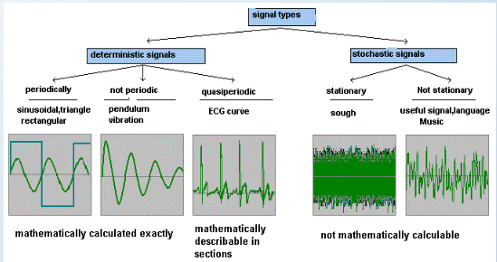

- **Delenie z hľadiska spojitosti v čase:**
    - Analógové signály
        - spojité v čase
    - Diskrétne signály
        - spojité v hodnote, ale diskrétne v čase
    - Kvantované signály
        - diskrétne v hodnote, ale spojité v čase
    - Digitálne signály
         - diskrétne v hodnote a čase 

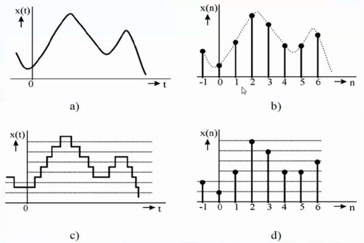

- **Delenie z hľadiska zložitosti:**
    - Jednoduché signály
        - napr. sínusovka, jednotkový impulz a pod.
    - Kompozitné signály
        - zložené z viacerých jednoduchých signálov s rôznou amplitúdou a frekvenciou

        

### Reprezentácia signálov vo frekvenčnej oblasti
- využitir transformačná (Fourierová,...)
- z časovej do frekvenčnej oblasti

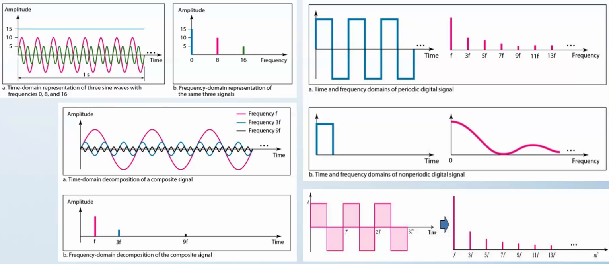

- signály vo frekvenčnej oblasti sú reprezentované frekvenciou na osi X a amplitúdou na osi Y

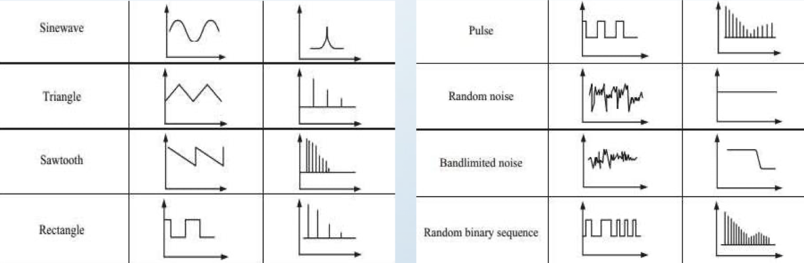

### Aproximácia signálov
- **Zovšeobecnený Fourierov rad**

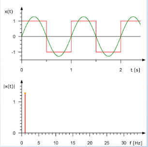

- čím viac deformujem sínusovku (dobre nastavené parametre) tak dokážeme aproximovať pravouhlý signál, ktorý bol vytvorený zo sínusovky, robím osciloskopom
- matematicky sa vykonáva pomocou:
	Zovšeobecneného Fourieroveho radu:

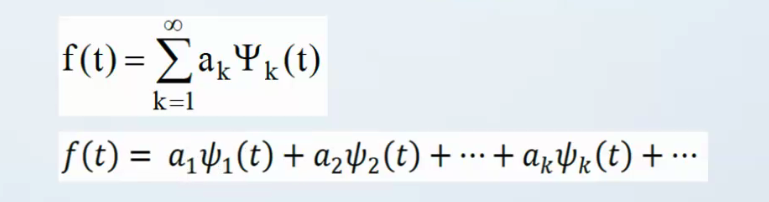

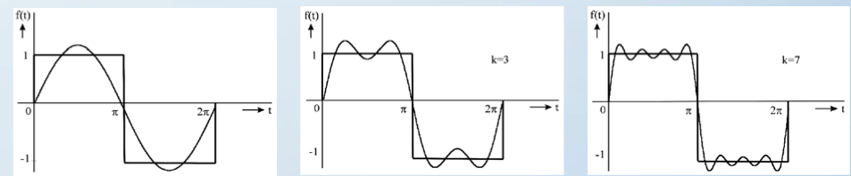

## Výkon a energia signálu:

- Výkon akú hodnotu vydá signál (vyšrafované pole obash)
- Energia je aký výkon signál vydá (Výkon na druhú)

- stredný normovaný výkon signálu:

    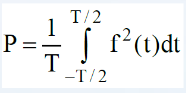
- normovaná energia signálu

    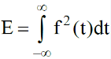

- Výkonové vs energetické signály:
    - výkonové signály majú konečný avšak  nenulový stredný normovaný výkon
    - k výkonovým signálom patria periodické, kváziperiodické a niektoré stochastické signály
    - energetické signály majp nenulovú avšak konečnú normovanú energiu
    - k energetickým signálom patria niektoré neperiodické a stochastické signály

### Ortogonálny a ortonormálny systém funkcií:

- Ortogonalita (napr cez optiku) púštam signál ktorý je opísaný funkciou (optika prenasam viacero signalov jeden pojde sinus, cosinu, spirala, dokazem preniest niekolko signalov naraz, taketo signaly maju byt na seba kolme)
- ak chcem prenasat viac signalov tak signaly musia byt ortogonalne (kolme na seba)
- ortonomálne signály sú stlačené do jedného malého vlákna 
- umožňuje prenášať viacero signálov cez spoločný kanál tak, aby boli úspešne detegované

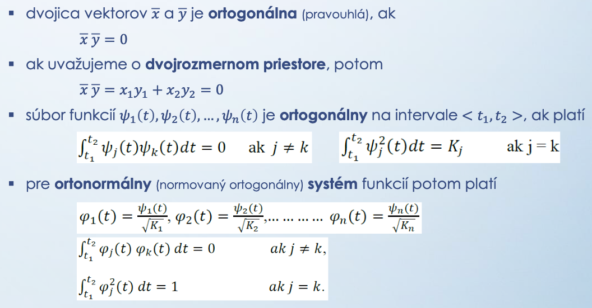

- ortogonalita je vlastnosť, ktorá umožňuje prenášať viacero signálov cez spoločný kanáltak, aby mohli byť úspešne detegované

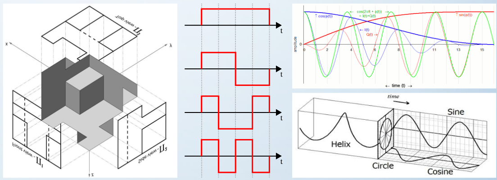

### Korelácia a konvolúcia signálov

#### Korelácia
- korelácia dvoch signálov vyjadruje všeobecne mieru zhodnosti, resp. podobnosti týchto signálov
- metóda porovnávania signálov cestou korelácie sa nazýva **korelačná analýza**

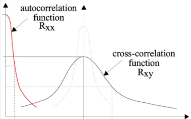

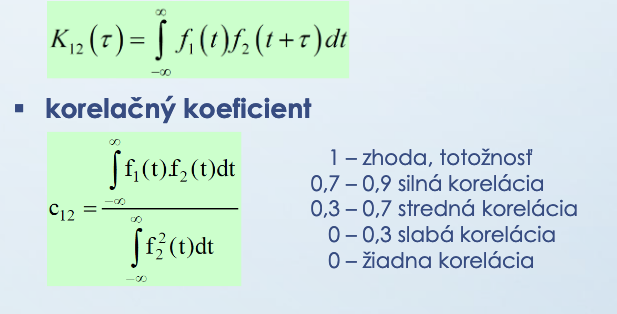

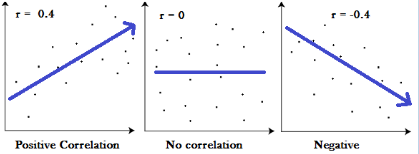

#### Konvolúcia

- Konvolucia zistujem vplyv nasobenia (ako na seba vplyvaju signaly vo frekvencii )
- vyjadruje vplyv násobenia v jednej oblasti (časovej) na druhú oblasť (frekvenčnej), resp. naopak
- konvolúcia je dôležitou vlastnosťou každej lineárnej transformácie a základom analýzy sústav 
- výmena indexov pri konvolúcii nevedie k zmene výsledku konvolúcie

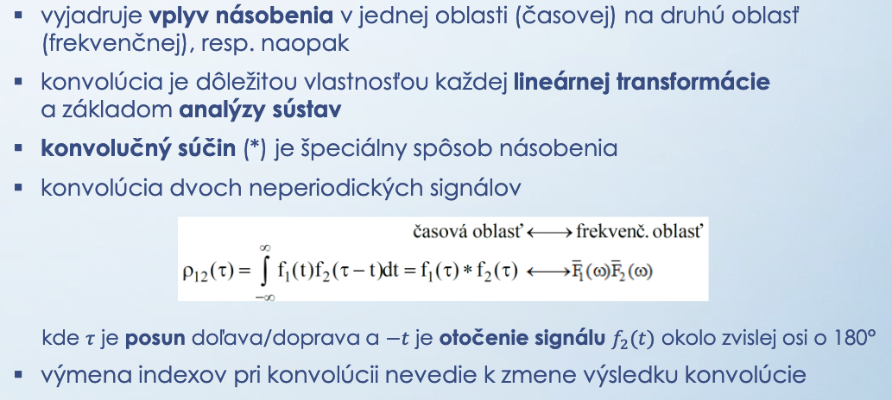

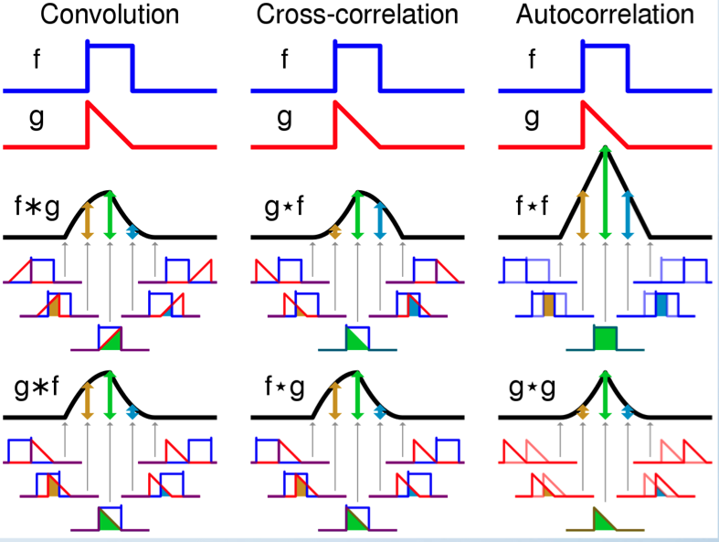

- vyuzitie obydvoch nasobenie pismena s nejakym signalom , tak deformujem E (deformácia obrázku, tiene )

## Prednáška č. 2

## Spracovanie multimediálnych signálov
### Základné pojmy:

- médium
    - môže byť fyzické (disk,…)
    - ale aj informácia, ktorá nie je uložená, ale je ďalej spracovávaná
    - v oblasti informačných a komunikačných technológii sa pojem médium vzťahuje na rôzne druhy informácii, ktoré sa spracúvajú a prenášajú
- multimédiá
    - {text, zvuk, video} z toho vznikajú dáta
    - viac len jeden druh informácie, ktorá sa má spracovávať/prenášať súčasne
- modalita
    - Audio modalita
    - Text modalita
    - Video medalita
    - kompaktná zložka multimediálnych dát
- multimediálny systém
    - sústava navzájom spojených súčiastok, ktoré  spracovávajú celý systém (zosilňovač, mikrofón)
    - systém na spracovanie, resp. prenos multimediálnych dát
- multimediálna aplikácia/služba
    - režim multimediálneho systému, ktorým sa realizuje spístupnenie multimédií používateľovi

### Klasifikácia modalít

- Vzhľadom na čas
    - statické (nemenia sa v čase)
        - text
        - grafika
        - statický obraz 
    - dynamické (menia sa v čase)
        - reč / hlas
        - audio
        - animácie
        - video
- Vzhľadom na priestor
    - jednorozmerné
        - reč / hlas
        - audio
    - dvojrozmerné
        - text 
        - grafika
        - statický obraz
    - viacrozmerné
        - animácie
        - video
- Iné druhy modalít
    - biologické signály
        - EEG, EKG, EMG, a i.
    - interaktívne systémy
        - behaviorálne
        - kognitívne
    - Internet vecí
    - distribuované výpočtové prostredie (cloud)

### Spracovcanie multimediálnych signálov

- Súhrn postupov, ktoré zabezpečujú. úpravu ich formy s ohľadom na ich ďalšie spracovanie a prenos k vzdialenému používaťeľovi. Zahŕňa 
    - Digitalizácia (diskretizácia) - prevod analógového signálu do číslicovej podoby
        - predspracovanie
        - vzorkovanie (diskretizácia)
        - kvantovanie
        -  binárne/zdrojové kódovanie
    - Kompresia - odstránenie redudancie (nadbytočnosti) obsiahnutej v dátach
        - dekorelácia zdrojových dát
        - kvantovanie a redukcia entropie
        - bezstratové / entropické kódovanie
    - Zapamätanie - proces uloženia modality do pamäte s cieľom jej archivácíe
    - Indexácia - proces uloženia metainformácie o modalite s cieľom jej rýchleho vyhľadávania
    - Vyhľadávanie - proces výberu archivovanej modularity z pamäte

### Digitalizácia signálov - Predspracovanie

**Predsparacovanie dolnopriepustným filtrom (low-pass filtering) pred vzorkovaním**
    - pred vzorkovaním musíme analógový signál filtorvať dolnopriestupným filtrom, aby sme obmedzili jeho maximálnu frekvenciu, čí ovplyvníme aj vzorkovaciu frekvenciu fs = 1/Ts
    - filtráciou odstránime komponenty vyšších frekvencii, ktoré ovplyvňujú tvar signálu, čím predídeme následnému skresleniu signálu v ďalšom kroku digitalizácie signálu
    - tento proces sa nazýva inak aj anti-aliasing (zabránenie prekývania sa sprektier signálu)

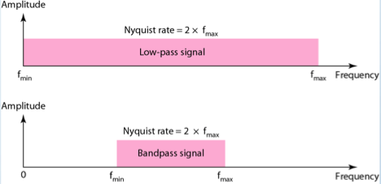

### Digitalizácia signálov - Vzorkovanie

- efekt Aliasingu

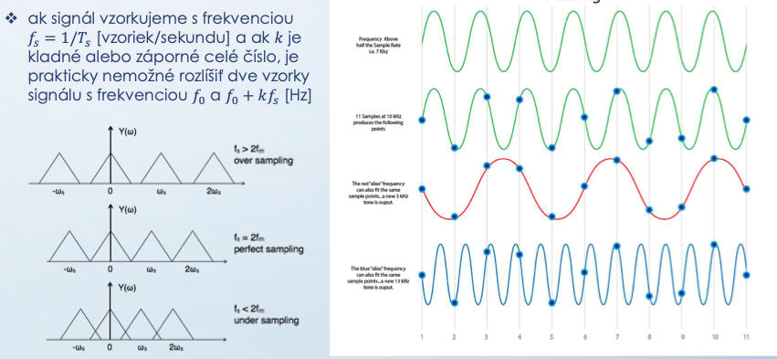

- **vzorkovanie (sampling) jednorozmerných signálov**
    - analógový signál po obmedzení dolnopriepustným filtrom je vzorkovaný každých 𝑇𝑠sekúnd, pričom 𝑇𝑠je **vzorkovacia perióda**
    - výstupom je signál diskrétny v čase, ale spojitý v amplitúde (hodnote)
    - Shannonova-Koteľnikova/Nyquistovaveta o vzorkovaní –vzorkovacia frekvencia           
                𝑓𝑠=1/𝑇𝑠
        - musí byť minimálne 2x väčšia než maximálna frekvencia vzorkovaného signálu

- pričom platí, čím vyššia je vzorkovacia frekvencia, tým lepšia bude rekonštrukcia signálu
- tento proces sa nazýva aj **pulzná amplitúdová modulácia** (pulse amplitude modulation, skr. PAM)

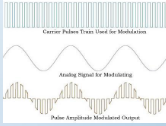

- existujú 3 spôsoby vzorkovania signálu
    - ideálne (ideal) –vzorka signálu je jednotkový impulz, pričom šírka impulzu je nekonečne malá
    - prirodzené (natural)–vzorka signálu je krátky impulz s meniacou sa amplitúdou
    - ploché(flat-top) –vzorka signálu je krátky impulz s konštantnou amplitúdou

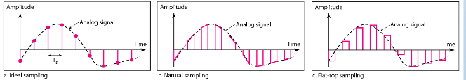

- *** Vzorkovanie (sampling) dvojrozmerných signálov**
    - pri spracovaní dvojrozmerných signálov ako sú napr. statické obrazy je rozumné vzorkovať aspoň 5x jemnejšie, než je teoretická hranica daná vzorkovacou vetou 
    - výber vzorkovacej mriežky
        - štvorce (rectangular sampling)
        - trojuholníky (polygonal triangular sampling)
        - šesťuholníky (hexagonal sampling)
    - jednému vzorkovanému bodu v mriežke zodpovedá jeden obrázkový prvok (pixel)

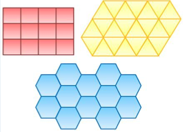

### Digitalizácia signálov - Kvantovanie

- kvantovanie (quantization)
    - proces konverzie spojitej amplitúdy vzoriek signálu do konečného počtu kvantizačných hladín, ktoré je možné kódovať konečným počtom bitov 
    - amplitúda medzi jednotlivými vzorkami signálu nadobúda nekonečne veľa hodnôt, preto sa snažíme tento nekonečný počet namapovať na konečný počet hodnôt 
    - to sa dá dosiahnuť rozdelením intervalu hodnôt medzi minimálnou a maximálnou hodnotou vzorkovaného signálu do 𝑁 úrovní s veľkosťou ∆, pričom ∆= (𝑚𝑎𝑥 − 𝑚𝑖𝑛)/𝑁 
    - počet úrovní 𝑛-bitového kvantizátora je potom 𝑁 = 2𝑛 
    - rozlišujeme skalárne a vektorové (blokové) kvantovanie 

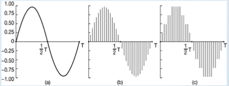
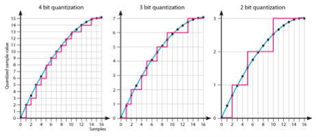

- typy kvantizátorov
    - lineárny(uniform) skalárny kvantizátor –rovnomerné rozloženie kvantizačných                              a rozhodovacích úrovní
    - adaptívny(adaptive) skalárny kvantizátor –ako lineárny skalárny kvantizátor avšak                            na obmedzenom intervale hodnôt, prispôsobuje kvantizačný krok vstupnej, resp. výstupnej postupnosti hodnôt
    - nelineárny(non-uniform) skalárny kvantizátor –nerovnomerné rozloženie kvantizačných            a rozhodovacích úrovní (exponenciálne narastá)
    - nelineárny skalárny kvantizátor s kompandovaním (companding) –aproximácia nelineárneho kvantizátora pomocou kompresora, lineárneho kvantizátora a expandéra
    - vektorový(blokový)kvantizátor-každému vstupnému vektoru hodnôt v N rozmernom priestoreje priradený jeden z výstupných vektorov (z tzv. kódovej knihy)

 - lineárnych  vs nelineárny skalárny kvantizátor:
 
 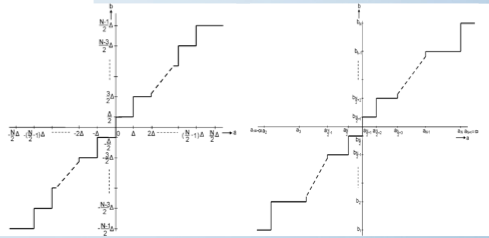

#### adaptívny skalárny kvantizátor
- kvantizátor s doprednou (feedforward) adaptáciou
- kvantizátor so spätnoväzobnou (feedback) adaptáciou

 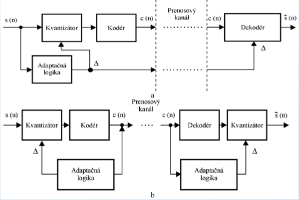

 #### nelineárny skalárny kvantizátor s kompandovaním

- kompresia (compression) –realizuje nelineárnu transformáciu vstupnej postupnosti hodnôt 
- lineárne skalárne kvantovanie –rovnomerné rozdelenie                                                 kvantizačných a rozhodovacích úrovní                                                                                         s optimálnym kvantizačným krokom
- expanzia (expansion) –vykonáva transformáciu                                              kvantovanej postupnosti na výstupnú postupnosť hodnôt

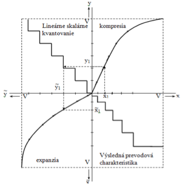

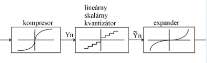

- činiteľ kompresie – charakterizuje zakrivenie kompresnej charakteristiky, ktorá má logaritimický priebeh

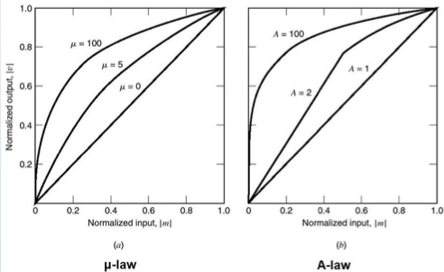

#### Kvantizácia(quantization) dvoj-a viacrozmerných signálov
- vektorová(bloková) kvantizácia–proces priradenia každému vstupnému vektoru hodnôt jeden z výstupných vektorov (z tzv. kódovej knihy) v N rozmernom priestore
- kóderaj dekóderobsahujú rovnakú kódovú knihu, po prijatí sa z tejto kódovej knihy vyberie reprezentatívny vektor

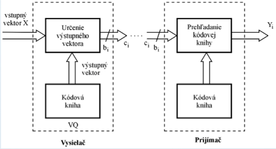

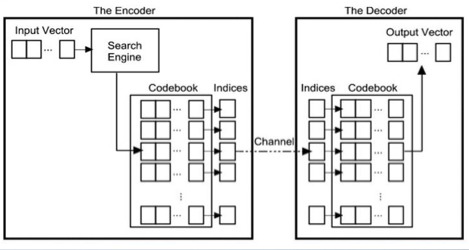

- kvantovanie hodnôt dekorelovaných transformačných, resp. subpásových koeficientov
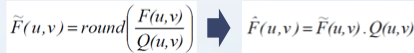
- faktor kvality
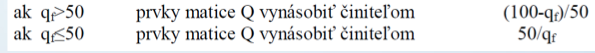

- **kvantizačný šum (chyba, skreslenie)**
- rozdiel medzi aktuálnou amplitúdou a strednou hodnotou kvantizačnej úrovne
- so zvyšujúcim sa počtom kvantizačných úrovní sa kvantizačná chyba zmenšuje
- rozlišujeme
    - **granulačný šum** –odchýlky vstupných                                                                                                  hodnôt premenných od hodnôt                                                                                                  príslušných kvantizačných úrovní
    - **šum z preťaženia kvantizátora** –prípad,                                                                                                    kedy hodnota vstupnej premennej prevyšuje                                                                                    rozsah kvantizátora, potom na jeho výstupe                                                                                   bude maximálna hodnota jeho rozsahu 
    - **neistota kvantovania** –kvantizátor si                                                                                                             nie je istý, ktorej kvantizačnej hladine                                                                                     priradiť hodnotu

    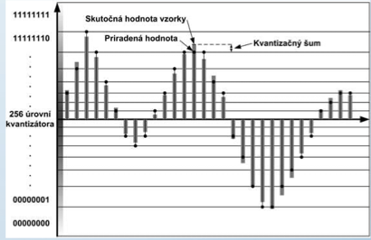

### Digitalizácia signálov - Kódovanie

- **binárne/zdrojové kódovanie**
- každej kvantizačnej úrovni je potom priradený binárny kód
- v prípade 3-bitového kvantizátora je potom dĺžka kódového slova 3 a počet kódových slov 2 na 3=8, obdobne v prípade 4-bitového kvantizátora je potom dĺžka kódového slova 4 a počet kódových slov 2 na 4=16

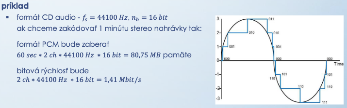

### Digitalizácia signálov

- princíp prevodu analógového signálu do číslicovej podoby a naopak
- proces sa označuje aj akopulzná kódová modulácia (pulse code modulation)

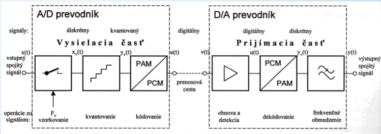

## Prednáška č.3
## Základné parametre modalít

### TEXT
- jasová rozlišovacia schopnosť
    - počet stupňov jasu, ktoré sa vyjadrujú bimárnym číslom s určitým počtom bitov pripadajúcich na jednotlivé obrazové prvky (op) “px”
- Priestorová rozlišovacia schopnosť
    - počet obrazových prvkov reprezentujúcich obraz v horizontálnom a vertikálnom smere na jednotku dĺžky (palac = 25.4 mm)
    - Horizontálna rozlišovacia schopnosť
        - počet obrazových prvkov na jednotku dĺžky (dpi - dots per inch)
    - Vertikálna rozlišovacia schopnosť
        - počet riadkov na jednotku dĺžky (napr. na 1 mm)

Napr. priestorovej rozlišovacej schopnosti
            300 dpi, 150 dpi, 75 dpi

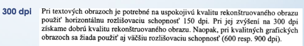

### Viacúrovňové obrazy

- **jasová rozlišovacia shopnosť**
    - počet bitov p na obrazový prvok, kde p>=1, pričom počet jasových úrovní je 2na p
    - Binárne statické obrazy, ak p =1
    - Viacúrovňové statické obrazy, ak p>1
- **Priestorová rozlišovacia chopnosť**
    - rozmer matice m*n, kde m je počet obrazových prvkov v horizontálnom smere a n je počet riadkov
- **Bitová rovina**
    - rez obrazu v obrazovom priestore
    - statický obraz s priestorovou rozlišovacou schopnosťou 8 bitov/op možno rozložiť na 8 bitových rovín

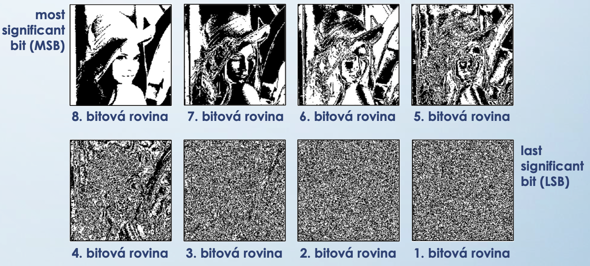

- **Histogram**
    - grafická závislosť, kde na horizontálnej osi sú vynesené jasové úrovne a na vertikálnej osi je vynesená početnosť výskytu týchto jasových úrovní

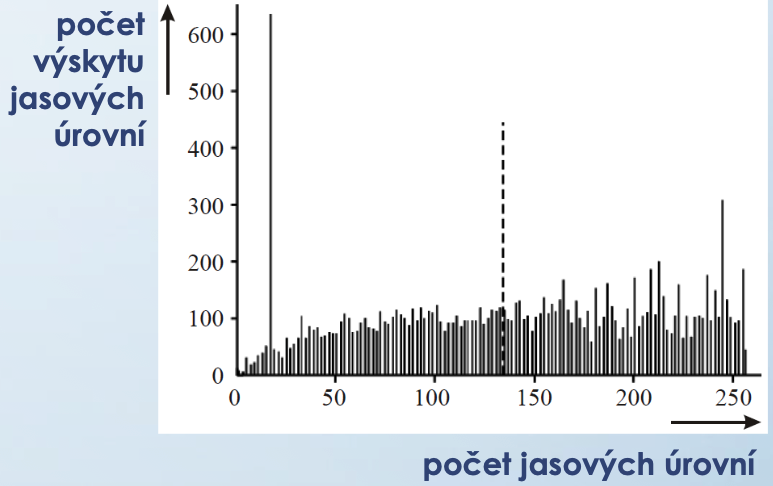

### Farebné obrazy

- **kolorimetrický priestor**
    - matematická reprezentácia ľudského vnímania farby
- **farbocit**
    - subjektívna vlastnosť ľudského zraku, pričom je známe, že ľudský jedinec je schopný rozoznať 4 základné farby, a to červenú, zelenú, modrú a žltú
- **miešanie farieb**
    - aditívne miešanie farieb
        - výsledná farba sa získa súčasným dopadom dvoch alebo viacerých farebných svetlelných lúčov na bielu plochu s konštantným činiteľom odrazu
    - substraktívne miešanie farieb
        - výsledná farba vzniká odčítaním určitých farebných zložiek od bieleho svetla, čím sa mení polomer ostatných zložiek bieleho svetla
- **farebné obrazové modely**
    - sú charakterizované súborom základných farieb, postupmi ich miešania a pravidlami určujúcimi zmeny farebných charakteristík

!!! Keďže ľudská sietnica obsahuje tri typy receptorov na vnímanie farieb, farebné obrazové modely obsahujú tiež tri komponenty pre popis farieb

- **Farebný obrazový model RGB (red - greeen - blue)**
    - trojzložkový adatívny model založený na trichromatickej teórii
    - každá zložka kvantovaná na 8 bitov, t.j 256 jasových úrovní
    - celkový počet farebných odtieňov 2 na 24 (true color)
- **Farebný obrazový model CMY/CMYK (cyan - magenta - yellow - black)**
    - trojzložkový subtraktívny model
    - rešpektuje emíriu miešania farieb maliarmi (využívajú v polygrafii)
    - kompelementárny k modelu RGB
- **Farebný obrazový model HSV / HSB / HSL (hue - saturation - value / britness / lightness)**
    - vyvinutý pre potreby počítačovej grafiky a analýzu digitálnych obrazov
    - nelineárne deformácie farebnej jednotkovej RGB kocky
    - **Farebný odtieň (hue)** definuje stupeň otočenia na štandardnom farebnom spektrálnom kuželi
    - **Sýtosť / čistota farby** (saturation) definuje prímes inej farby
    - **Jasová zložka** (value /brightness / lightness) je definovaná v intervale 0 až 1
- **Farebný obrazový model YUV/YCbCr (luminance - chrominance U /V)**
    - transformácia modelu RGB pomocou vytvorenia luminančnej (jasovej) zložky Y a dvoch chrominančných komponentov U a V, resp. činnej modrej zložky Cb a kvadratúrnej červenej zložky Cr 
- **Vzorkovanie vo farebných modeloch**
    - model 4:4:4 - zachovaný počet obrazových prvkov pre jasovú a chromatické zložky
    - model 4:2:2 - počet chromatických zložiek podvzorkovaný v horizonatálnom smere v pomere 2:1
    - model 4:2:0 - počet chormatických zložiek podvzorkovaných v horizontálnom aj vertikálnom smere v pomere 2:1 (JPEG)
    - model 4:1:1 - počet chromatických zložiek podvzorkovaný v horizontálnom smere v pomere 4:1
- farebná paleta – vopred definovaná vyhľadávacia tabuľka, v ktorej každý údaj obsahuje 24 bitovú informáciu (3x 8 bitový údaj) udávajúcu farebný odtieň
- farebná hĺbka – počet použitých farebných odtieňov pre daný farebný obraz 

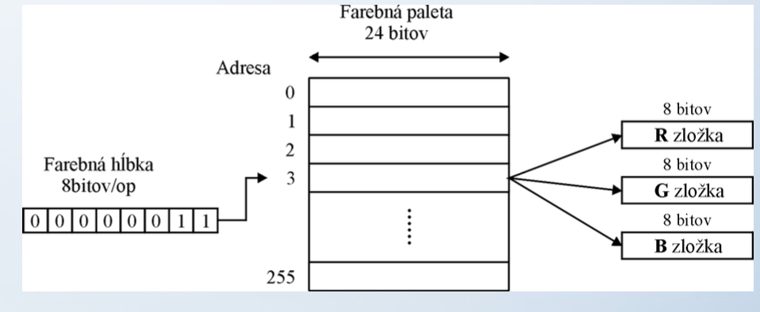

### Reč a Audio

- rečové a audio signály vznikajú transformáciou mechanického vlnenia v látkovom prostredí na elektrický signál (pomocou elektroakustického meniča - mikrofónu) 
- reč – akustický vnem vyvolaný človekom vybudením vokálového traktu 
- audio – akustické vnemy generované aj inými zdrojmi, napr. hudobnými nástrojmi 

- **Základné parametre rečových aaudio signálov**
    - frekvenčný rozsah –pre reč 300 až 3400 Hz;pre audio 20 Hz až 20 kHz
    - amplitúda signálu –dolná hranica určená prahom počuteľnosti(0 dB), horná prahom bolestivosti(pri akustickom tlaku 100 až 120dB)
    - vzorkovacia frekvencia –musí spĺňať podmienku vzorkovacieho teorému 𝑓𝑣𝑧≥2𝑓𝑚𝑎𝑥
    - počet kvantizačných úrovní –štandardne pre reč 8 bit/vzorku, pre audio 16 bit/vzorku
    - prenosová rýchlosť

    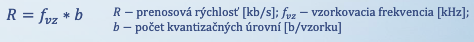

- **základné delenie rečových aaudio signálov**
    - telefónna (telephone) reč –širka pásma od 300 do 3400 Hz, 𝑓𝑣𝑧= 8 kHz
    - širokopásmová (broadband) reč –širka pásma od 50 Hz do 7 kHz, 𝑓𝑣𝑧= 16 kHz(VoIP)
    - strednopásmové (mediumband) audio–širka pásma od 10 Hz do 11 kHz, 𝑓𝑣𝑧= 24 kHz
    - širokopásmové (broadband) audio–širka pásma od 10 Hz do 22 kHz, 𝑓𝑣𝑧= 48 kHz
    
    - CD kvalita –širka pásma od 10 Hz do 22 kHz, 𝑓𝑣𝑧= 44,1kHz, resp. 32 –48 kHz

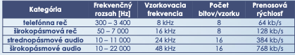    

### Video

- **základné parametre digitálneho videa**
    - spôsob snímania obrazu
        - s prekladaným riadkovaním(interlaced scanning)
        - s neprekladaným riadkovaním (progressivescanning)
    - jasová rozlišovacia schopnosť –počet bitov na obrazový prvok (typicky8 bit/op)
    - priestorová rozlišovacia schopnosť–maximálny počet vzájomne sa striedajúcich čiernych a bielych vertikálnych riadkov v obraze (525 NTSC, 625 PAL a SECAM)
    - pomer strán (aspect ratio)–pomer šírky a výšky obrazu, štandardne 4:3, HDTV 16:9
    - vzorkovacia frekvencia –daná horizontálnou a vertikálnou rozlišovacou schopnosťou, snímkovou frekvenciou a pomerom strán obrazu❖snímková frekvencia (frame rate) –počet snímok za sekundu (typicky25 až 30 snímok/s)
    - prenosová rýchlosť

    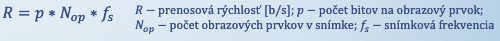    
    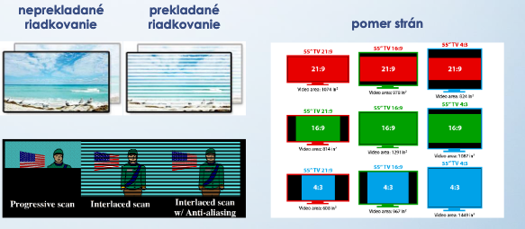 

- štandardné televízne normy
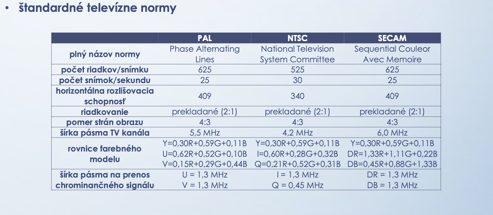 
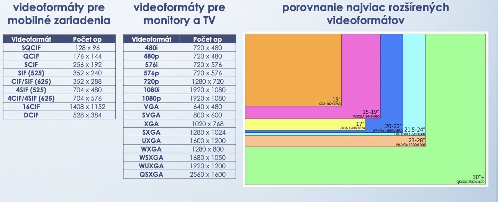 

## Prednáška č.4
## Hodnotenie kvality modalít

### Hodnotenie kvality modaliít v multimédiách

- **hodnotenie kvality možno realizovať**
    - objektívne hodnotenie kvality (objective quality assesment)
        - spôsob hodnotenia prebieha matematickým výpočtom pomocou vzorcov
        - porovnávam originál so skreslenou verziou
    - subjektívne hodnotenie kvality (subjective quality assesment)
- parametre na hodnotenie kvality modalít
        - hodnotí sa na vzorke účasníkov, anketa, ľudia ktorý sú trénovaní (zvukári, filmový režiséri)
    - parametre QoS (quality of services)
        - kvalita prenosu dát a sieťové parametre
    - parametre QoE (quality of experience)
        - kvalita obsahu modality z pohľadu používateľa

### Hodnotenie kvality statických obrazov

- stredná kvadratická chyba MSE (mean square error)
- stredná absolútna chyba MAE (mean absolute error)
- normalizovaná stredná kvadratická chyba (normalize)
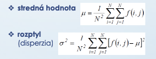
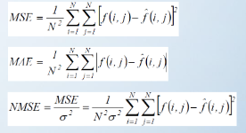

- pomer signálu k šumu (signal to noise ratio) SNR
- špičkový pomer signálu k šumu (peak SNR)
- index štrukturálnej podobnosti (structural similarity index)
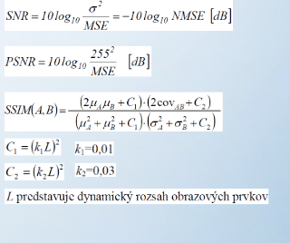

### Hodnotenie kvality reči a audia
- objektívne metriky
    - pomer signálu k šumu (SNR)
- subjektívne metriky
    - test zrozumiteľnosti (diagnostic rhyme test) –založený na rozpoznaní slova z dvojice zvukovo príbuzných slov (rež –hreš, ber –ver, a i.), hodnoty v rozmedzí 75 až 90
    - test DAM –realizovaný trénovanými poslucháčmi, ktorí sú schopní postrehnúť zmenu kvality rečového signálu s akustickými štandardmi, hodnoty v rozmedzí 40 až 55%
    - test MOS –5 stupňov hodnotenia

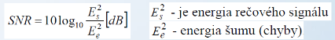

### Hodnotenie kvality videa
- objektívne metriky
    - dátové metriky –hodnotia objektívnu kvalitu      videa z pohľadu rekonštruovaného obrazového                         signálu, bez zohľadnenia jeho obsahu
- obrazové metriky –zohľadňujú vizuálnu informáciu a jej obsah cez modely HVS (SSIM)
- metriky využívajúce pakety/bitové toky –využíva sa informácia obsiahnutá v hlavičke paketov a zakódovanom bitovom toku, bez potreby dekódovania videa
- hybridné metriky–využívajú kombináciu predošlých metrík
- z pohľadu množstva referenčnej informácie
    - metriky typu FR –miera degradácie testovaného videa v porovnaní s referenčným
    - metriky typu NR –vychádzajú z degradácie obsahu testovaného videa a typov skreslenia
    - metriky typu RR –založené na extrakcii určitých príznakov z testovaného a referenčného videa

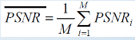

- subjektívne metriky (podľa ITU-R Rec. BT.500 aITU-T Rec. 910)
    - metóda DSCQS –subjekty hodnotia dvojicu videosekvencií (testovacia vs. referenčná)
    - metóda DSIS –subjektyhodnotiastupeň degradácie kvality testovaného videa
    - metóda SSCQE –subjekty sledujú video v trvaní 20-30 min. a priebežne hodnotia kvalitu
    - metóda ACR –subjekty hodnotia kvalitu každého testovaného videa, bez referenčného
    - metóda PC –subjekty hodnotia kvalitu každého páru testovaného videa tej istej scény

## Prednáška č.5
## Spracovanie multimediálnych signálov

- kompresia –odstránenie redundancie (nadbytočnosti) obsiahnutej v dátach
    - dekorelácia zdrojových dát
    - redukcia entropie kvantovaním (lossy compression)
    - bezstratové kódovanie (lossless compresion)

### Kompresia multimediálnych dát

- **kompresia** - úprava zdrojových dáť, ktoré vedú k zníženiu ich objemu, miera zníženia nárokov na prenosovú rýchlosť
    - prečo? 1 A4 textu s 400 dpi = 2 MB, obraz veľkosti 512x512 a 24 bit/op = 6,30 MB, apod.
    - ako? - využitie korelácie medzi obrazovými prvkami/snímkami
    
    - činiteľ kompresie (compression ratio)
        
    - úspora kapacity pamäte
    

### Všeobecný model kompresie
- **dekorelácia vstupných dát** - analýza vstupných dát, odstránenie redundancie
- **redukcia entrópie** - redukcia informačného obsahu realizovaná blokovou kvantizáciou
- **bezstratové kódovanie** s variabilnou dĺžkou kódového slova (variable length coding)

- **Dekorelácia vstupných dát** - analýza vstupných dát, odstránenie redundancie (nadbytočnosti)
    - v časovej oblasti
        - metódy na báze lineárnej predikcie (linear prediction coding)
    - V transformovanej oblasti
        - dekompozícia pomocou diskrétnych ortogonálnych transformácii (transform coding)
            - diskrétna kosínusová transformácia
            - diskrétna Fourierová transformácia
        - dekompozícia na subpásma (subband coding)
            - subpásmové kódovanie
            - kódovanie na báze waveletov (diskrétnej waveletovej transformácie)
            - pyramídové kódovanie
        - parametrickej oblasti (parametric coding) - transformácia do parametrickej oblasti
            - fraktálové kódovanie
- **Redukcia entropie** - neusporiadanosti dát
    - kvantizácia
        - vektorová (bloková) kvabtizácia

- **bezstratové kódovanie**
    - prúdové kódovanie (run-length coding)
    - entropické kódovanie
        - Shannonovo-Fanovo kódovanie (prefix coding)
        - Huffmanovo kódovanie (optimal prefix coding)
        - aritmetické kódovanie (arithmetic/asymmetric coding)
    - Lempelovo-Zivovo-Welchovo kódovanie (variable-widthcoding)

## Predikčné kódovanie

- v časovej oblasti
    - predikčné kódovanie (predictive codding)

### Kódovanie v časovej oblasti

- **predikčné kódovanie = diferenciálna pulzná kódová modulácia (DPCM)**
    - keďže susedné vzorky obrazových, resp. rečových signálov sú navzájom korelované,                         stačí prenášať len ich diferenciu
    - predikčné kódovanie využíva predpoveď hodnôt vzoriek signálu pomocou predošlých hodnôt, vyjadrených lineárnou kombináciou predchádzajúcich                                                                           hodnôt vzoriek signálu

### Predikčné kódovanie

- **základné delenie**
    - **jednorozmerná predikcia**
        - v oblasti rečových a audio signálov sa využíva rozdiel medzi okamžitou a predchádzajúcou hodnotou vzorky signálu
        - v priestore obrazových prvkov sa uvažuje s lineárnou kombináciou vzorky signálu v tom istom riadku, resp. stĺpci alebo hodnotou vzorky signálu a na tej istej pozícii v predchádzajúcej snímke
    - **dvojrozmerná predikcia** vnútrosnímková predicia
        - v priestore obrazových prvkov sa k predikcii používa okrem hodnôt vzoriek signálu v tom istom riadku/stĺpci aj lineárna kombinácia hodnôt vzoriek signálu z minulých riadkov/stĺpcov
    - **trojrozmerná predikcia** medzisnímková predikcia
        - obdobne ako u dvojrozmerného prediktora, k predikcii však využíva tiež lineárna kombinácia hodnôt vzoriek z predchádzajúcej snímky

 - **ďalšie delenie**
    - podľa rádu prediktora
        –počet predchádzajúcich hodnôt vzoriek signálu, ktoré sa budú vpredikcii uplatňovať
        –tzv. prediktory prvého, druhého, tretieho rádu, atď. (počet koeficientov lineárnej rovnice)
    - podľa linearity
        –lineárna predikcia –lineárna kombinácia predchádzajúcich hodnôt vzoriek signálu–nelineárna predikcia 
        –nelineárna kombinácia predchádzajúcich hodnôt vzoriek signálu
    - podľa typu adaptácie (adaptive DPCM -ADPCM)
        –prediktor bez adaptácie –adaptácia kvantizátora (kvantizačného kroku)
        –adaptácia prediktora (koeficientov prediktora) –kvantizátor bez adaptácie
        –súčasná adaptácia prediktora aj kvantizátora
    - podľa spôsobu adaptácie
        –dopredná (feedforward) adaptácia
        –spätnoväzobná (backward) adaptácia

- princíp skenovania a výpočtu koeficientov v lineárnej dvojrozmernej DPCM (raster scan order)

- princíp výpočtu predikčných koeficientov v prípade detekovaných hrán a použitia nelineárnej DPCM

- predikčné kódovanie je **veľmi náchzlné na skreslenia** najmň v oblastiach smrtných prechodov signálu (na hranách), kedy dochádza k preťaženiu prevodovej charakteristiky kvantizátora (tzn. ak hodnota predikovaných vzoriek signálu prekročí rozsah kvantizačných úrovní)

- typy skreslenia v DPCM
    - **granulačný šum**(granular noise) –náhodný šum v bielych plochách obrazu (neistotakvantizácie)
    - **diskontinuita hrán** (edge busyness) –prítomnosť svetlých miest v tmavých hranách obrazu (neistotakvantizácie)
    - **rozmazanie hrán** (slope overload)                                                                                                             –dôsledok preťaženia kvantizátora                                                                                                            (výstup sa mení skokovito, priebeh zaostáva za zmenou vstupného signálu)

- **Použitie predikčného kódovania**
    - bezstratová kompresia viacúrovňových a farebných obrazov (JPEG)
    - kódovanie vektorov pohybu vo videu pri medzisnímkovej predikcii (MPEG)
    - kódovanie syntetickej reči a audia (linear predictive coding, LPC)

- **Zhodnotenie predikčného kódovania**
    - redukcia štatistickej redundancie reprezentovaná korelovanosťou signálu
    - vnútrosnímkové predikčné kódovanie redukuje iba priestorovú koreláciu
    - medzisnímkové predikčné kódovanie redukuje nielen priestorovú, ale aj časovú koreláciu
    - adaptácia kódera môže nastať buď na úrovni kvantizátora, na úrovni prediktora, alebo na oboch úrovniach, tým sa dosiahne jej lepšie prispôsobenie vlastnostiam signálu, a teda aj možnosť ďalšieho zvyšovania účinnosti kódovania
    - veľkosť skreslenia je určená okrem počtu, veľkosti a rozloženia kvantizačných úrovní aj zmenou štatistických vlastností signálu
    - sú jednoducho realizovateľné, no málo odolné voči rušeniu

- **Predikčné kódovanie**
    - predikčné kódovanie využíva predpoveď aktuálnych hodnôt vzoriek signálu pomocou predošlých hodnôt vzoriek signálu
    - aktuálne hodnoty vzoriek signálu potom vieme vyjadriť pomocou lineárnej kombinácie určitého presne definovaného počtu predchádzajúcich vzoriek signálu

- **Potom**
    - ak len v horizontálnom resp. vertikálnom smere, tak sa jedná o jednorozmernú predikciu
    - ak súčasne v horizontálnom aj vertikálnom smere, tak sa jedná o dvojrozmernú predikciu (priestorová predikcia/vnútrosnímková predikcia)
    - ak pridáme aj hodnotu vzoriek signálu v predchádzajúcich snímkach, tak sa jedná trojrozmernú predikciu (priestorová a časová predikcia/medzisnímková predikcia)
    - ak do úvahy berieme len hodnotu predchádzajúcej vzorky signálu, ide o prediktor 1. rádu
    - ak do úvahy berieme hodnoty dvoch predchádzajúcich vzoriek, tak ide o prediktor 2. rádu
    - ak do úvahy berieme hodnoty npredchádzajúcich vzoriek, tak ide o prediktor n-tého rádu
    - ak výpočet aktuálnej hodnoty predikovanej vzorky sa určí na základe lineárnej kombinácie predchádzajúcich hodnôt, tak ide o lineárny prediktor
    - ak výpočet aktuálnej hodnoty predikovanej vzorky sa určí na základe nelineárnej (pomerovej) kombinácie predchádzajúcich hodnôt, tak ide o nelineárny prediktor
    - ak hodnota predikčných koeficientov je pevne stanovená, tak ide o prediktor bez adaptácie
    - ak hodnota predikčných koeficientov je závislá od hodnoty vstupnej alebo výstupnej postupnosti vzoriek, tak ide o prediktor s adaptáciou

## Prednáška č.6
## Transformačné kódovanie

- **vo frekvenčnej oblasti**
    - **transformačné kódovanie** (transform coding) - dekompozícia na subspektrá
        - dekompozícia signálov pomocou pravouhlých funkcií(Walshove-Hadamardove transformácie, Haarova a šikmá „slant“ transformácia)
        - dekompozícia signálov pomocou goniometrických funkcií                                                        (diskrétna Fourierova transformácia a diskrétna kosínusová transformácia)

### Transformačné kódovanie

- **diskrétne ortogonálne transformácie (DOT) + pulzná kódová modulácia (PCM)**
    - dekompozícia vstupného signálu do priestoru transformačných koeficientov                        (transformácia z časovej do frekvenčnej oblasti)
    - kompresia údajov sa dosahuje potlačením irelevantných spektrálnych koeficientov
    - účinnosť kódovania ovplyvňuje najmä druh diskrétnej ortogonálnej transformácie, rozmer bloku, výber a efektivita kvantovania a kódovania spektrálnych koeficientov

- **prečo vlastne používame transformáciu?**
    - lineárne transformácie dekorelujú náhodné premenné
    - rotácia a škálovanie patria medzi základné lineárne transformácie
    - ľubovoľný vstupný signál môže byť reprezentovaný lineárnou kombináciou bázových funkcií DOT
    - otáčaním bázových funkcií v N-rozmernom sig. priestore vzniká množina nových bázových funkcií
    - Parsevalova teoréma –celkový výkon signálu vo časovej oblasti sa rovná celkovému výkonu signálu v transformovanej (frekvenčnej) oblasti

- prečo vlastne používame transformáciu?
    - ku každej ortonormálnej transformácii existuje jej inverzná funkcia

- **základné kritéria** na výber vhodnej diskrétnej ortogonálnej transformácie
    - účinná dekorelácia vstupných dát
    - koncentrácia energie do malého počtu spektrálnych koeficientov
    - použitie bazových funkcií umožňujúcich zachovanie subjektivnej kvality rekonštruovaného signálu
    - jednoduchá kvantizácia transformačných (spektrálnych) koeficientov
    - nízka výpočtová náročnosť

 - z hľadiska použitia bazových funkcií delíme diskrétne ortogonálne transformácie
    - pravouhlé funkcie
        –Walshove-Hadamartove transformácie
        –Haarova transformácia
        –šikmá „slant“ transformácia
    - goniometrické funkcie
        –Karhunen-Loéveova transformácia
        –diskrétna Fourierova transformácia
        –diskrétna kosínusová transformácia

- dvojrozmerná diskrétna kosínusová transformácia (DCT)

- **kvantovanie** hodnôt transformačných koeficientov

- **faktor kvality**

- koncentrácia energie vo vybraných blokoch koeficientov DCT pred a po kvantizácii

- v RL kódovaní sa transformuje postupnosť dvojíc symbolov(symbol 1, symbol 2)
- symbol 1 -počet nulových koeficientov (0-15koeficientov)
- symbol 2 -veľkosť (amplitúda) nenulového koeficienta

- **z hľadiska kvantovania transformačných koeficientov**
    -   kvantovanie lineárnym/nelineárnym kvantizátorom s konštantným počtom bitov
    - blokové kvantovanie s nerovnomerne prideľovaným počtom bitov
- **z hľadiskaľudského systému vnímania (HVS –human visual system)** 
    - kvantizačný krok by sa mal voliť tak, aby kvantizačný šum bol pod vizuálnym prahom
    - vizuálne prahy sú rôzne pre rozdielne priestorové frekvencie                                                                 (pri transformačnom kódovaní pre nízke priestorové frekvencie)
    - perceptívne optimalizovanej kvantizácie, ktorá používa maticu kvantizačných váh                              (od toho závisí aj kompresný pomer a kvalita rekonštruovaného obrazu)
- **z hľadiska výberu a lokalizácie transformačných koeficientov**
    - neadaptívne–fixné pravouhlé okno, zonálna filtrácia (nemenia sa štatistické vlastnosti kód. obrazu)
    - adaptívne  
        - prahová filtrácia –prenášajú sa koeficienty, ktoré majú hodnotu väčšiu ako zvolený prah
        - adaptívna zonálna filtrácia –premenlivá veľkosť okna, preusporiadanie do „cik-cak“ postupnosti

- **Použitie**
    - vnútrosnímkové kódovanie obrazov na báze DCT (JPEG)
    - medzisnímkové kódovanie videa na báze DCT (MPEG)
    - kódovanie reči a audia na báze modifikovanej DCT (MPEG-4 AAC)

- **Hodnotenie**
    - vysoká účinnosť kódovania–kompresiu údajov dosahuje potlačením irelevantných spektrálnych koeficientov
    - malá citlivosť na zmeny štatistických charakteristík vstupného signálu
    - rozloženie kvantizačnej a kanálovej chyby na celé bloky vzoriek signálu
    - relatívne zložitá technická realizácia

## Prednáška č.7
## Subpásmové kódovanie

- **subpásmové kódovanie** (subband/filterbank coding) - dekompozícia na subpásma
    - **decimácia a interpolácia**
    - **diskrétna waveletová transformácia**
    - **pyramídové kódovanie**

### Decimácia a interpolácia 

- **dekompozícia do niekoľkých pásiem**, v ktorých prebieha kódovanie nezávisle
- umožňuje monitorovať energiu dekomponovaných zložiek signálu v subpásmach
- dekompozícia signálu sa realizuje pomocou banky filtrov
- banka filtrov pozostáva z FIR filtrov (výkonovo komplementárnych kvadratúrnych zrkadlových fitrov QMF)

- **regulárna stromová štruktúra pre dvojkanálové subpásmové kódovanie**

- **neregulárna(dyadická) banka filtrov**–frekvenčné pásmo je rozdelené oktávovo na nerovnako veľké subpásma (lepšie vystihuje vlastnosti HVS/HAS)
- na úspešnú rekonštrukciu signálu potrebujeme poznať iba vzorky z hornopriepustného filtra každej úrovne rozlíšenia, tie predstavujú detaily, ktoré musíme pridať k odhadu signálu  v nižšej úrovni, aby sme mohli zrekonštruovať vyššiu úroveň

### Kódovanie na báze waveletov

- dekompozícia originálneho signálu na signálové komponenty
- waveletová transformácia používa časovo ohraničené funkcie, tzv. wavelety
- zovšeobecnenie časovo-frekvenčnej (spektrálnej)analýzysignálov
- alternatívaku krátkodobej Fourierovej transformácii(STFT)
- umožňuje získať v rôznych časoch apri rôznych frekvenciách odlišné rozlíšenie (časová lokalizácia udalostí aj v získanom spektre)
- transformácia pomocou waveletov môže byť chápaná aj ako dekompozícia vo frekvenčnej oblasti s priestorovým usporiadaním
- využíva základné (materské) waveletové funkcie, ktoré môžu byť rozťahované (dilatované)alebo posúvané
- rozklad signálu do množiny funkcií, ktorých základom je materská waveletová funkciaψ(t)(Haarova, Meyerova, Morletova, Daubechiesovej), z ktorej sú odvodzované ďalšie funkcie postupnoudilatáciou (a)aposunom v čase (t)
- waveletová transformácia potom hľadá podobnosť waveletu s časťouanalyzovaného signálu

 
 
 

- koeficientyWT tvoriahierarchickú údajovú štruktúru(pyramídu)
- existuje tu značná korelácia medzi absolútnymi hodnotami koeficientov susedných hladín
- nulové stromy (zerotrees) –úsporné kódovanie nevýznamných koeficientov tvoriacich rodinu
 

 ### Pyramídové kódovanie

 - **hierarchická reprezentácia obrazov** zakladajúca sa na princípe rekurzívnej dekompozície signálov
 - každá **vyššia hladina pyramídy je odvodená od predošlej nižšej hladiny** určitou aritmetickou operáciou nad ohraničenou skupinou obrazových prvkov

 

 - Typy pyramíd
    - neprekrývateľné (typ. 2x2op) –každý blok obrazového prvku na nižšej hladine vytvára jediný obrazový prvok na vyššej hladine
    - prekrývateľné (typ. 5x5op) -každý blok obrazového prvku na nižšej hladine sapodieľa na vytvorení viacerých obrazových prvkov na vyššej hladine
        –Gaussova pyramída –aplikácia DP filtra na predošlú hladinu spojenú s decimácioupriestorovej rozlišovacej schopnosti, pričom váhovú funkciu možno aproximovať Gaussovým rozdelením
        –Laplaceova pyramída –postupnosť pásmovo filtrovaných obrazov (rozdiel susedných hladín Gaussovej pyramídy), úprava rozmeru vyššej hladiny Gaussovej pyramídy sa realizuje interpoláciou (vsunutím) obrazového prvku medzi dva obrazové prvky

- konštrukcia Gaussovej (vľavo) a Laplaceovej pyramídy (vpravo)
 

 - vzťah medzi Gaussovou a Laplaceovou pyramídou
  

  - princíp pyramídového kódovania obrazov
   

### Supásmové kódovanie
- **Použitie**
    - analýza signálov a spojitých sústav (predpoveď zemetrasenia, analýza turbulencií, a i.)
    - hierarchický režim zobrazovania pomocou pyramídového kódovania (JPEG)
    - kódovanie statických obrazov na báze diskrétnej waveletovej transformácie (JPEG2000)
    - väčšina rečových aaudio kodekov pracuje na princípe subpásmového kódovania
    - ochrana multimediálneho obsahu pomocou digitálnej vodotlače na báze DWT

**Zhodnotenie**
- vysoká účinnosť kódovania
- bezstratová kompresia signálov
- perfektná rekonštrukcia signálu
- zložitá technická realizácia

## Prednáška č.8
## Bezstratové kódovanie

- bezstratové kódovanie s variabilnou dĺžkou kódového slova (variable length coding)
 

 ### Základné pojmy:
 - majme zdrojovú abecedu A, ktorá má m symbolov: s1, s2, …. sm. Pre každý symbol si máme definovanú početnosť výskytu pi
- informačná hodnora symbolu si
 
- entropia (miera neurčitosti) je potom priemerná informačná hodnota na jeden symbol 
 
- pomer kompresie
 
- faktor kompresie
 

- kódovanie s premennou dĺžkou kódového slova (variable length coding, VLC)
 

-   **typy kódovania**
    - prúdové kódovanie (run-length coding)
    - entropické kódovanie
        –Shannonovo-Fanovo kódovanie (prefix coding)
        –Huffmanovo kódovanie (optimal prefix coding)
        –aritmetické kódovanie (arithmetic/asymmetric coding)
    - Lempelovo-Zivovo kódovanie (variable-widthcoding)

- **prúdové kódovanie** (run-length coding, RL coding)
    - pôvodne vyvinuté pre binárne obrazy
    - založené na kódovaní dĺžky opakujúcich sa znakov a počtu ich výskytov
    - bezstratové, symetrické a rýchle kódovanie, za cenu nízkeho kompresného pomeru 
    - využíva sa najmä pri kódovaní transformačných koeficientov v štandarde JPEG, kde sa kóduje poloha a počet nenulových koeficientov

- **Shannonovo-Fanovo kódovanie**
    - štatistická metóda bezstratovej kompresie
    - množina znakov je delená rekurzívne na dve podmnožiny tak, aby súčet výskytov znakov v oboch podmnožinách bol približne rovnaký
    - je to suboptimálny prefixový kód
    - konštrukcia v tvare od koreňa k listom
    - používa sa v kompresnom formáte ZIP

    

- **Huffmanovo kódovanie**
    - základné entropické (bezstratové) kódovanie s premennou dĺžkou kódového slova
    - najviac vyskytujúcim znakom je priradené najkratšie kódové slovo (podobne ako           u Morseovej abecedy)
    - optimálny prefixový kód❖je to najkratší kód, má                                                                                                      minimálnu strednú dĺžku                                                                                                      kódového slova
    - konštrukcia v tvare                                                                                                          od listov ku koreňu
    - používa sa v štandardoch                                                                                                     JPEG, MPEG, Ogg/Vorbis,                                                                                                      WMA, ACC

    

- **aritmetické kódovanie**
    - odstraňuje nedostatky Huffmanovho kódovania
    - entropické (bezstratové) kódovanie s premennou dĺžkou kódového slova
    - postupné (proporcionálne) delenie, zužovanie a spresňovanie intervalu <0, 1>
    - znaky, ktoré majú vysokú pravdepodobnosť zužujú interval <0, 1> najmenej
    - efektívny kód, oproti Huffmanovmu kódovaniu dáva o 5-10% lepší kompresný pomer
    - zložitý na výpočet –náročné aritmetické operácie s reálnymi číslami
    - problémy s implementáciou kvôli patentu
    - ďalšie modifikácie aritmetického kódovania, ktoré berú do úvahy kontext
        –CAVLC(context-adaptive variable length coding) –s premennou dĺžkou kódového slova
        –CABAC(context-adaptive binary arithmetic coding) –s pevnou dĺžkou kódového slova
    - modifikované verzie aritmetického kódovania CAVLC a CABAC sa používajú najmä      vo video štandarde H.264

   

- **Lempelovo-Zivovo kódovanie**
    - slovníkový algoritmus, prijatý symbol alebo reťazec je reprezentovaný indexom v slovníku
    - vychádza z myšlienky nahradenia postupnosti symbolov referenciou na ich predchádzajúci výskyt
    - inak označované ako substitučné kódovanie
    - nevyužíva štatistický model početností
    - typy Lempelovho-Zivovho kódovania
        – LZ77–slovníkom je časť vstupného textu, používa vždy trojice (triplety) dát
        – LZ78 –veľkosť slovníka môže byť neobmedzená, namiesto trojíc používa dvojice [index, znak]
        – LZW(Lempel-Ziv-Welch coding) –Welchom vylepšený LZ78, pracuje s postupnosťou indexov
    - používa sa najmä v kompresnom formáte GIF

- rozdelenie metód bezstratového kódovania                                                                    z hľadiska dĺžky zdrojových vektorov v kódovej knihe a dĺžky kódových slov

## Prednáška č.9
## Analýza obsahu multimediálnych signálov

- **analýza obsahu obrazových signálov** (image content analysis)
    - základné vlastnosti obrazových signálov
        – farba (color), farebný tón (hue), sýtosť (saturation)a jas (brightness)
        – textúra(texture)
        – histogram
    - perceptívne (psychovizuálne) vlastnosti obraz. signálov –model ľudského vizuálneho systému
        – priestorové maskovanie (spatial filtering)
            - citlivosť oka na intenzitu
            - adaptácia oka na intenzitu (simultaneous contrast)
        – Machov pásmový efekt (Mach band effect)
    - morfologické vlastnosti obrazových signálov –segmentácia obrazu
        – prahovanie (thresholding)
        – matematická morfológia binárnych obrazov –dilatácia, erózia, otvorenie a uzatvorenie
        – detekcia hrán a rohov (edge/corner detection)
        – detekcia kontúry a tvaru (contour/shape detection)
        – metóda watershed
        – zhluková analýza (image clustering)
        – analýza pohybu (motion analysis)

### Základné vlastnosti obrazových signálov

- farba (color)
    - farebný tón/odtieň (hue)
        –stupeň odlíšenia farby, otočenia sa v kolorimetrickom priestore
    - sýtosť/čistota farby (saturation)–prímes inej farby
    - jas (brightness/lightness/value)–intenzita svetla od svetlej po tmavú

- **textúra** (texture)
    - predpis, ktorý definuje vlastnosti určitého materiálu v grafike, a ktorý opisuje jeho správanie pri interakcii s lúčmi svetla
    - zvyčajne uložená vo forme bitmapy a „nanáša sa” na trojrozmerný objekt

    - histogram–grafická závislosť, kde na horizontálnej osi sú vynesené jasové úrovne a na vertikálnej osi je vynesená početnosť výskytu týchto jasových úrovní

    

### Perceptívne vlastnosti obrazových signálov

- **priestorové maskovanie** (spatial masking)
    - citlivosť oka na intenzitu
        – meranie minimálneho badateľného prírastku intenzity
        – Weberov zákon vyjadruje pomer medzi minimálnym badateľným prírastkom v intenzite jasu a samotnou intenzitou jasu obrazu
        – z toho dôvodu je rovnomerná úroveň šumu viac viditeľná v tmavších oblastiach obrazu ako vo svetlejších
    - adaptácia oka na intenzitu
        – ľudský vizuálny systém v rozličných okamihoch reaguje    na široké spektrum intenzít rozdielnym spôsobom

- **Machov pásmový efekt**(Mach band effect)
    - keď prechádza cez filter signál s ostrými nespojitosťami, objavia sa podkmity a prekmity
    - tento jav je čiastočne spôsobené nerovnomerným vnímaním jasu vo vnútri regiónu rovnakej intenzity

       

### Morfologické vlastnosti obrazových signálov

- **prahovanie (thresholding)**
    - vo všeobecnosti prevod viacúrovňového obrazu na binárny tvar
    - základe zvoleného kritéria sa snažíme určiť hraničnú hodnotu nejakého príznaku obrazu a podľa tejto hodnoty zatrieďujeme obrazové body do oblastí
    - typy prahovania
        – globálne prahovanie
        – lokálne prahovanie
        – adaptívne prahovanie 
        – intervalové prahovanie
        – poloprahovanie
        – prahovanie s viacerými prahmi

    
    

- **detekcia hrán a rohov** (edge/corner detection)
    - hľadanie oblastí v obraze, kde dochádza k výraznej zmene jasu, resp. intenzite jasu
    - hranaje hranica medzi dvoma oblasťami s relatívne rozdielnymi hodnotami jasu 
    - v ideálnom prípade ide o získani uzatvorených kriviek, ktoré vyznačujú hranice objektov
    - matematicky sa vykonáva výpočtom prveja druhej derivácie a určením gradientu
    - operátory na výpočet gradientu
        - Robertov operátor
        - Prewittov operátor (1. derivácia)
        - Laplaceov operátor (diferencia a vyhladenie)
        - Sobelov operátor (2. derivácia)
    - ďalšie metódy na detekciu hrán
        - Cannyho detektor hrán
        - detekcia prechodu nulou

    
    

- **detekcia kontúry a tvaru** (contour/shape detection)
    - nájdenie uzavretého ohraničenia objektu
    - v podstate sa jedná o vyplešený algoritmus na detekciu hrán
    - nemusí ideálne opisovať hrany objektu
    - používa sa najmä pri detekcii a sledovaní objektov v obraze, detekcii úst, tváre a pod.

- **metóda watershed**
    - predstavme si viacúrovňový obraz ako topografický povrch, intenzita kóduje výšku terénu
    - ak začneme zaplavovať oblasť lokálneho minima, získame segmentovaný obraz
    - nevýhodou je tzv. „nadsegmentácia“

- **zhluková analýza** (image clustering)
    - zhlukovanie objektov, ktoré majú približné rovnaké vlastnosti
    - metódy zhlukovej analýzy
        - k-najbližších susedov
        - hierarchické zhlukovanie
        - fuzzy zhlukovanie
        - metóda podporných vektorov
        - neurónové siete
        
        

- **analýza pohybu** (motion analysis)
    - založená na tzv. estimácii pohybu, t.j. výpočte relatívneho posunutia bloku obrazových prvkov v aktuálnej a predošlej snímke videa, ktoré sa označuje ako vektor pohybu
    - algoritmy na estimáciu pohybu delíme na
        – iteračné algoritmy –pracujú na úrovni obrazových prvkov a sú založené na rekurzívnej minimalizácii predikčnej chyby; ich použitie je obmedzené len na veľmi malý pohyb
        – algoritmy s blokovým prehľadávaním –vychádzajú z predpokladu, že všetky obrazové prvky v bloku obrazu vykazujú rovnaký pohyb; pre každý blok v aktuálnej snímke sa hľadá najpodobnejší blok v predchádzajúcej snímke

- **analýza pohybu** (motion analysis)
    - algoritmus s blokovým prehľadávaním

    - premietnutie bloku A do bloku B v predošlej snímke
    – najpodobnejší blok k bloku A vo vyhľadávacej oblasti
    – rozdiel pozícií bloku C a bloku B je pohybový vektor
    – rozmer blokov NxN
    – maximálne posunutie 𝑑𝑚
    – vyhľadávacia oblasť           (N+2𝑑𝑚)x(N+2𝑑𝑚)

- **analýza obsahu rečových a audio signálov**
    - základné vlastnosti rečových a audio signálov
        - analýza signálu v čase (time-domain features) 
        - spektrálna analýza (spectral-domain features)
        - kepstrálna analýza (cepstral features)
        - harmonická analýza (harmonic features)
        - viackanálová analýza(multi-channel features)
    - perceptuálne (psychoakustické) vlastnosti                                                                              rečových a audio signálov
        - krivka počuteľnosti
        - absolútny prah počuteľnosti (absolute threshold of hearing)❖maskovací efekt
        - časové maskovanie (temporal masking)
        - frekvenčné maskovanie (simultaneous masking)
    - sémantické vlastnosti rečových a audio signálov

### Základné vlastnosti rečových a audio signálov

- **analýza signálu v čase**
    - spracovanie signálu po blokoch (windowing)
    - časová obálka (temporal envelope)
    - krátkodobá energia signálu (short-time energy)                                                                                                    – nadobúda vyššie hodnoty                                                                                                      pre znelé úseky reč

- **analýza signálu v čase** 
    - počet prechodov nulou (zero-crossing rate)                                                                                                 
        – nadobúda vyššie hodnoty                                                                                                      pre neznelé úseky reči
        –príklad jednoduchého                                                                                                         detektora rečovej aktivity

- **analýza signálu v čase**
    - autokorelačná funkcia(autocorrelation function) –zvýrazňuje periodické zložky v signále,               slúži a odhad základnej frekvencie hlasu (fundamental frequency)

- **spektrálna analýza**
    - dekompozícia signálu na jednoduchšie časti opisujúcezložkysignálu vo frekvenčnom spektre (frekvenčné komponenty)pomocou rýchlej Fourierovej transformácie (FFT)
    - základné vlastnosti spektra
        - obálka spektra (spectrum envelope)
        - výkonová spektrálna hustota (power spectrum distribution) –celkový výkon prenášaný signálovými komponentami
    - momentové charakteristiky
        - spectral roll-off –určuje hranicu, kde sa nachádza najväčšia časť energie spektra
        - spectral flux –popisuje časové zmeny v spektre signálu
        - spectral centroid –definuje ťažisko spektra
        - spectral spread –definuje varianciu (odchýlku od) spektra
        - spectral slope –popisuje stŕmosť spektra
        - spectral skewness –popisuje šikmosť spektra
        - spectral kurtosis –určuje špicatosť spektra

- **kepstrálna analýza**
    - logaritmus spektra signálu po aplikácii inverznej Fourierovej transformácie (IFFT)
    - metóda získania vyhladeného a zvýrazneného spektra

    

- **harmonická analýza**
    - audio signály sú často harmonického charakteru, v tom prípade sa spektrum primárne skladá z jednotlivých zložiek, ktoré sa opakujú v rovnakých rozostupoch (násobkoch základej frekvencie)
    - analýza zohráva veľký význam napr. pri potláčaní echa (echo cancellation)
    - hamonickosť signálu sa vyhodnocuje najčastejšie pomocou autokorelačnej analýzy

   

- **viackanálová analýza**
    - priestorová filtrácia signálov (spatial filtration)
    - lokalizácia zdroja zvuku a jeho sledovanie (beamforming)
    - etekciapresluchov
    - separacia signálov

### Perceptívne vlastnosti rečových a audio signálov

- **krivka počuteľnosti*
    - absolútny prah počuteľnosti ľudského ucha definuje krivka počuteľnosti, ktorá je nelineárne a frekvenčne závislá
    - zložky, ktoré ležia pod absolútnym prahom počuteľnosti, nie je potrebné kódovať a prenášať
    - v okolí signálu s vysokou frekvenciou dochádza k deformácii krivky počuteľnosti
    - maskovací efekt = signály, ktoré boli pôvodne nad úrovňou počuteľnosti sa dostanú pod deformovanú krivku

    

- **jednodušený model maskovania**
    - používa frekvenčnú stupnicu udávanú v barkoch, založenú na kritických frekvenčných pásmach
    - kritické frekvenčné pásma korešpondujú so šírkami pásiem,   tzv. kochlearnej banky filtrov, inšpirovaná modelom vnutorného ucha človeka
    - kritické pásma majú konštantnú  šírku 100 Hz do 500 Hz, pre vyššie frekvencie sa šírka zväčšuje o 20%
    - frekvenčný rozsah rečových         a audio signálov možno pokryť     26-timi kritickými pásmami
   
   
   

- **maskovací efekt**
    -fenomém časového maskovania (temporal masking) vznik v prípade existencie určitej dĺžky časového okamihu, v ktorom ucho nedokáže rozoznať dva po sebe nasledujúce akustické udalosti, ak jeden je silnejší ako druhý
    - resp. ak maskovací (silnejší)                a maskovaný (slabší) signál nastali hneď po sebe s určitým časovým posunom
    - v štandarde MPEG sa takto     maskuje echo

  

 - **maskovací efekt**
    - frekvenčné maskovanie (simultaneous masking) vzniká vtedy, ak sa v rovnakom časovom okamihu výskytnú dva akustické signály príbuznej frekvencie, kedy silnejší signál (má viac dB) zamaskuje slabší
    - resp. ak sa hlasnejší zvuk (maskovací) vyskytuje v rovnakom časovom okamihu ako slabší (maskovaný), vtedy hlasnejší prekryje slabší, ktorý je za normálnych okolností počuteľný

 

## Prednáška č.10
## Štandardy na kódovanie statických obrazov

### Prehľady štandardov

- **JPEG**
    - definovala skupina expertov (JPEG -joinphotographicexpertsgroup)
    - vyvíjal sa od roku 1983
    - dokončený v roku 1986
    - štandardizovaný v roku 1992 –ITU-T Recommendation a 1994 –ISO/IEC 10918-1
    - súbory s príponou .jpg alebo .jpeg
- **JPEG 2000** 
    - štandardizovaný v roku 2000 –ISO/IEC 15444-1:2000
    - súbory s príponou .jp2alebo.j2c
- **Ďalšie kompresné formáty**
    - GIF (graphics interchange format)
    - PNG (portable network graphics)
    - WebP (Google)

### JPEG

- **požiadavky**
    - kompresný pomer na špičkovej úrovni s výbornou kvalitou rekonštruovaného obrazu
    - použiteľnosť na väčšinu viacúrovňových afarebných obrazovv ľubovoľnom farebnom priestore a pri ľubovoľnej veľkosti
    - výpočtová náročnosť na úrovni dostupnýchtechnických a programových prostriedkov
    - realizácia 4 režimov činnosti
        – sekvenčné kódovanie
        – postupné kódovanie
        – hierarchické kódovanie
        –bezstratové kódovanie
    - podpora 2 základných prístupov v kódovaní 
        – stratové kódovanie na báze DCT
        – bezstratové kódovanie na báze predikčného kódovania

 

**Kódovanie v JPEG**

- v RL kódovaní sa transformuje postupnosť dvojíc symbolov(symbol 1, symbol 2)
- symbol 1 -počet nulových koeficientov (0-15koeficientov)
- symbol 2 -veľkosť (amplitúda) nenulového koeficienta

 

### Ďalšie režimy kódovania v JPEG
    - postupný (progressive) režim
        - kódovanie obrazu na bázediskrétnej kosínusovej transformácie(DCT)
        - najprv v hrubých rysoch, neskôr v detailoch
        - rýchlejšie rozpoznanie obsahu na prijímacej strane ako pri sekvenčnom prenose pri vysokej kvalite
        - prenos v postupnom režime možno realizovať pomocou dvoch metód
            – spektrálna selekcia
            – postupná aproximácia
    - hierarchický (hierarchical) režim
        -kódovanie obrazu pyramidálnym spôsobom, ako postupnosť hladín
        - základňu pyramídy tvorí originálny obrazv plnej priestorovej rozlišovacej schopnosti
        - každá vyššia hladina sa získa redukciou priestorovej rozlišovacej schopnosti faktorom 2
    - bezstratový (lossless) režim
        - kódovanie obrazu pomocou dvojrozmernej predikcie

**spektrálna selekcia**
    - v prvej iterácii sa prenesú iba DC koeficienty každého bloku obrazu
    - v ďalších iteráciách sa prenesú skupiny AC koeficientov v postupnosti „cik-cak“
    - tento postup zodpovedá prenosu nízkych obrazových frekvencií nasledovaných vysokými obrazovými frekvenciami

**postupná aproximácia**
    - v prvej iterácii sa prenesú iba DC koeficienty každého bloku obrazu v plnom počte bitov
    - v ďalších iteráciách sa prenesie určitý počet najvyšších bitov všetkých AC koeficientov
    - počet bitov sa postupne zvyšuje až sú prenesené všetky bity kvantovaných AC koeficientov celého obrazu

**hierarchický režim**
    -používa sa všade tam, kde je potrebné prispôsobiť priestorovú rozlišovaciu schopnosť parametrom výstupných zariadení s nižšou rozlišovacou schopnosťou

 **bezstratový režim****
    - využíva predikčné kódovaniebez využitia DCT
    - prediktor generuje predikčnú hodnotu obrazového prvku s využitím troch susedných obrazových prvkov A,B aC
    - bezstratovým kódovaním VLCsa kóduje rozdiel medzi skutočnou a predikovanou hodnotou
    - Huffmanov / aritmetický kód
    -činiteľ kompresie 2

### JPEG2000
- základná charakteristika 
    - vysoká účinnosť kompresieobrazov v zmysle počtu bitov na obrazový prvok
    - účinná kompresia obrazov v širšom rozsahu jasovej rozlišovacej schopnosti (do 16 bit/op)
    - režim so stratovoua bezstratovou kompresiou
    - možnosť postupného prechoduod stratovej k bezstratovej kompresii
    - postupný prenos obrazov s rozlíšením a presnosťou na jeden obrazový prvok
    - umožňuje kódovanie oblastí záujmu
    - otvorená architektúra umožňuje optimalizovať kódovanie pre rôzne typy obrazov
    - architektúra odolná voči chybám
    - podporuje ochranu autorských práv

**princíp kódovania** 
    - vstupný obraz dekomponovaný na obrazové zložky
    - obrazové zložky dekomponované na pravouhlé bloky
    - na každý blok sa aplikuje waveletová transformácia
    - každý blok sa rozdelí na rôzne úrovne rozlíšenia (horiz., vert., diag. a aprox.)
    - jednotlivé úrovne vytvárajú subpásmové koeficienty
    - subpásmové koeficienty sú kvantované a zoskupené do kódových blokov
    - koeficienty v kódovom bloku sú kódované po bitových rovinách
    - určité oblasti záujmu (region of interest coding) možno kódovať kvalitnejšie než pozadie
    - výstupný bitový tok obsahuje na svojom začiatku hlavičku

### Predspracovanie v JPEG 2000
- základné operácie 
    - dekompozícia originálneho obrazu na pravouhlé neprekrývateľné segmenty
    - posun jednosmernej úrovne (od hodnotyvzorkysaodčíta konštanta 2 na 𝑝−1, kde pje počet bitov na vzorku obrazovej zložky)
    - transformácia obrazových zložiek –zlepšuje kompresiu a umožňuje kvantizáciu iba vizuálne relevantnej informácie

### Kompresia v JPEG 2000
- základné operácie
    - waveletová transformácia –analýza obrazových komponentov na rôznych úrovniach dekompozície, ktoré reprezentujú subpásma so zodpovedajúcimi koeficientami
    - kvantizácia–redukcia presnosti vyjadrenia transformačných koeficientov             (stratová operácia)
    - entropické kódovanie –realizuje sa modifikovaným aritmetickým kódovaním, ktoré používa adaptívne modely obsahujúce 18 rôznych kontextov pre kódovanie              (MQ algoritmus)

### Výstupný dátový tok

- výstupný dátový tok má hierarchickú štruktúru
- každá obrazová zložka sa delí na pravouhlé neprekrývateľné segmenty, ktoré sa hierarchicky delia na paketové bloky a tieto na kódové bloky (32x32 resp. 64x64op)
- v každom subpásme sú kódové bloky navštevované zľava doprava a zhora nadol
- kódové bloky kódované nezávisle po bitových rovinách(od najvyššej po najnižšiu), čo umožňuje realizovať ľubovoľný prístup k obsahu obrazu a paralélne kódovanie
- bitové roviny kódované aritmetickým kódovaním v troch prechodoch
- komprimovaný bitový tok kódových blokov v troch paketových blokoch tvoria najvyššiu úroveň
    - paket–jednotkový prírastok kvality na danej úrovni rozlíšenia v danej priestorovej lokalite
- súbor paketov na rovnakej úrovni delenia segmentu vytvára vrstvu
    - vrstva–jednotkový prírastok kvality v celom rozsahu rozlíšenia obrazu
- hlavička–séria údajov: veľkosť obrazu, jasová rozlišovacia schopnosť, farebný model, farebná paleta, farebná hĺbka, priestorové rozlíšenie originálneho obrazu, priestorové rozlíšenia pre zobrazovací mód, výstupný dátová tok, blok ochrany autorských práv 

### Ďalšie režimy v štandarde JPEG 2000
- definovanie oblastí záujmu –oblasť záujmu kódovaná vo vyššej kvalite ako pozadie a posunutá počas prenosu smerom k vyšším bitovým rovinám
- škálovateľnosť –schopnosť kódovania obrazu viac než v jednej kvalite a rozlíšení súčasne
    - škálovanie v pomere SNR
    - škálovanie v priestorovej oblasti
- režim zvýšenej odolnosti voči chybám –použitie VLC na báze aritmetického kódovania je náchylné k chybám -> vhodná štruktúra dát, spätná synchronizácia, detekcia chýb a i.
    - na úrovni etropického kódovania
    - na úrovni paketov
- váhovanie priestorových (vizuálnych) frekvenciípomocou funkcií citlivosti na kontrast CSF (contrast sensitivity function)
- ochrana autorských práv na báze vodoznakov

### Ďalšie kompresné štandardy

- GIF (graphics interchange format)
    - uvedený v roku 1987
    - predstavuje bitmapový formát s podporou 8-bitovej farebnej palety
    - vhodný pre obrazy s ostrými hranami a minimálnymi farebnými prechodmi
    - podpora priehľadnosti a animácií (umiestnenie troch 8-bitových rámcov na seba)
    - kompresia založená na Lempelovom-Zivovom-Welchovom algoritme

- PNG(portable network graphics)
    - predstavený v roku 1996, uvedený v roku 2004
    - bitmapový formát, ktorý mal nahradiť GIF
    - flexibilný formát so štruktúrou pripomínajúcou kontajner
    - pracuje v dvoch krokoch
        – predkompresia –dekorelácia vstupných dát na báze DPCM
        – kompresia –algoritmus DEFLATE a Huffmanovo kódovanie aplikované na bloky dát
    - lepšie zachovanie hrán a ostrých prechodov aj za cenu horšej kompresie než JPEG

- WebP (Google)
    - vydaný v roku 2010
    - spája výhody JPEG (dobré spracovanie plnofarebnej grafiky), JPEG 2000 (stratová a bezstratová kompresia), PNG (priehľadnosť v stratovom a bezstratovom režime) a GIF (podpora animácií)- 
    - kompresia je založená na predikcii blokov obrazu–troch nad a jedného naľavo od analyzovaného bloku
    - zle predikované a nepredikované bloky sa kódujú pomocou DCT a WHT
    - pri kódovaní výsledných blokov obrazu sa zvyčajne používa Huffmanovo kódovanie
    - účinnosť kompresie o 20% lepšia než konvenčné kompresné štandardy

## Prednáška č.11
## Štandardy na kódovanie rečových a audio signálov

 - metóda na kódovanie reči:
    - anylyticko-syntetické kódovanie

### Analyticko-syntetické kódovanie reči

- **Analyticko-syntetické kódovanie reči**
    - prirodzenú reč možno chápať ako odozvu vokálneho traktu na akustické budenie
    - vplyv zmeny tvarov a rozmerov jednotlivých častí vokálneho traktu na charakter akustickej vlny možno na prijímacej strane modelovať lineárnym číslicovým filtrom          s časovo premennými parametrami
    - digitalizovaný rečový signál sa najprv segmentuje na úseky dĺžky 10–30 ms
    - pre každý segment sa vypočíta súbor koeficientov určujúcich singularity prenosovej funkcie číslicového filtra
    - na vyjadrenie hodnôt koeficientov určujúcich singularity prenosovej funkcie sa najčastejšie využíva metóda lineárnej predikcie(LPC –linearpredictioncoding)
    - v LPC sa určujú parametre, ktoré minimalizujú strednú kvadratickú odchýlkumedzi skutočnými a predikovanými vzorkami rečového signálu

- Model generovania reči
    - budenie vokálneho traktu –impulzný generátor a generátor šumu, ktorých výstupy sú vynásobené veličinou G (ziskom)
    - filter vokálneho traktu –lineárny FIR filter s prenosovou funkciou 𝐻𝑧

- vypočítané parametre sú v časovom multiplexe prenášané na prijímaciu stranu, kde sa realizuje syntéza rečového signálu

- **znelý** vs. **neznelý** segment reči

- **optimálne kódovanie rečových signálov**
    - kombinácia metódy LPC a vektorového kvantovania,

    - metóda CELP(code-excitation linear prediction) –navysielaceja prijímacej strane je vytvorené identická kódová kniha budiacich postupností (prenosovárýchlosť 4-8 kb/s)
    - metóda LD-CELP(low delay CELP) –so spätnoväzobným riadením adaptácie je vylepšením CELP a znižuje oneskorenie z 35 ms až na 2 ms pri prenosovej rýchlosti 16 kb/s

### Štandardy na kódovanie reči

- základné parametre
    - prenosová rýchlosť –8-64 kb/s pre G.7XX, resp. 3,45-13 kb/s pre mobilné siete
    - oneskorenie–troj-až štvornásobok oneskorenia kódovacieho algoritmu,                 typicky až 60-80 ms, pre niektoré odporúčania iba 1,5-2 ms
    - zložitosť rečového kodéra –odvodená od typu použitého kódovacieho algoritmu
    - kvalita rekonštruovanej reči –v jednotkách QDU (quantization distortion unit)

- štandardy na kódovanie reči v časovej a transformovanej oblasti
    - G.711–PCM;8 bit/vzorku, 𝑓𝑣𝑧= 8 kHz;šírka pásma 3 kHz;prenosová rýchlosť 64 kb/s
    - G.722–2 bitový kvantizátor;kódovanie ADPCM;24 QMF filtrov;8 bit/vzorku, 𝑓𝑣𝑧= 16 kHz;            šírka pásma 7 kHz;prenosová rýchlosť 48, 56 a 64 kb/s;oneskorenie 1,5 ms
    - G.726–2, 3, 4 a 5 bitový kvantizátor;kódovanie ADPCM;prenosová rýchlosť 16, 24, 32 a 40 kb/s
    - G.727–ADPCM s vloženou kvantizáciou;používa sa v paketovom prenose reči

- štandardy na báze analyticko-syntetických metód s využitím LPC
    - G.728 –LD-CELP;kódová kniha s 128 vektormi;𝑓𝑣𝑧= 8 kHz, prenosová rýchlosť 16 kb/s;oneskorenie do 2 ms;pre aplikácieVoIPa videokonferenčné systémy
    - G.729–CS-ACELP;veľkosť rámca 10 ms;𝑓𝑣𝑧= 8 kHz;prenosová rýchlosť 8kb/s;pre aplikácie vo videotelefónii;veľmi zložitá implementácia algoritmu
    - G.731.1–dva rečové kodekyMPC-MLQ aACELP;veľkosť rámca 30 ms;prenosová rýchlosť 5,3 a 6,4 kb/s;oneskorenie až 67,5 ms;pre multimediálne aplikácie
    - G.722.2–ACELP;veľkosť rámca 20 ms a 16 LPC;𝑓𝑣𝑧= 16 kHz;širka pásma 50-70 Hz;prenos. rýchlosť od 6,6-23,85 kb/s;v moderných telekomunikačných sieťach na báze GSM, EDGE, 3G, UTMS a VoIP

- štandardy ITU-T pre mobilné siete
    - GSM RPE-LTP –RPE v LPC kódovaní s dlhodobou predikciou;prenos. rýchlosť 13 kb/s
    - ETSI GSM 06.10–𝑓𝑣𝑧= 8 kHz;prenos. rýchlosť 13 kb/s;len na prenos telefónnej reči;v GSM
    - ETSI GSM 06.20–VSELP;𝑓𝑣𝑧= 8 kHz;prenos. rýchlosť 5,6 kb/s;len na prenos tel. reči;v GSM
    - ETSI GSM 06.60–CS-ACELP;𝑓𝑣𝑧= 8 kHz;prenos. rýchlosť 13 kb/s;len na prenos tel. reči;v GSM
    - ETSI GSM 06.90–ACELP;𝑓𝑣𝑧= 8 kHz;prenos. rýchlosť 4,75-12,2 kb/s;v GSM, UMTS a VoIP
    - ETSI 36PP 26.290–ACELP-TCX;𝑓𝑣𝑧= 12,8-38,4 kHz;prenos.rýchl. 6,6-23,85 kb/s;v GSM, EDGE a UMTS

- štandardy pre mobilné siete v USA a Japonsku
    - TIA IS54–VSELP + 2 kódové knihy;prenos. rýchlosť 8 kb/s;pre mobilné siete na báze TDMA(USA)
    - TIA IS96–QCELP + CMSA;prenos. rýchlosť 1, 2, 4 a 8 kb/s;pre mobilné siete na báze CDMA(USA)
    - PDC v SELP–VSELP + 1 kódová kniha;prenos. rýchl. 6,7 kb/s;pre mobil. siete na báze TDMA (Jap.)
    - PDC PSI –CELP–PSI-CELP;prenos. rýchlosť 3,45 kb/s;pre mobilné siete na báze TDMA(Jap.)

- **porovnanie parametrov štandardovna kódovanie reči pre mobilné siete**

### Klasifikácia metód na kódovanie audia
- metódy na kódovanie audia
    - kódovanie audia vo frekvenčnej oblasti

### Kódovanie audia vo frekvenčnej oblasti

- základné metódy
    - subpásmové kódovanie(subbandcoding)
        – vstupný signál prechádza hybridnou bankou filtrov (M filtrov)
        – decimované vzorky sú kvantované a kódované
        – pri dekódovaní sa realizuje proces interpolácie určitým počtom nulových vzoriek
        – spätným prechodom cez banku filtrov sa získa rekonštruovaný signál
    - transformačnékódovanie(transform coding)
        – vzorky vstupného signálu sú lineárne transformované pomocou DOT na súbor dekorelovaných transformačných koeficientov
        – transformačné koeficienty sa kvantujú a prenášajú
        – v dekodéri sa realizuje inverzná transformácia, ktorou sa získajú rekonštruované časové vzorky
        – ak neuvažujeme kvantizačné skreslenie, proces rekonštrukcie je bezstratový
        – na odstránenie blokového efektu sa využíva modifikovaná DCTs 50% prekrývaním okiena hybridná bankaQMFfiltrov na flexibilné frekvenčné delenie vstupného signálu  

- prečo vôbec hybridná banka filtrov?
    - prepínanie veľkosti transformačného okna(window switching)
        – pre-echo–prechod medzi periódou ticha a nárazovým zvukom = veľká kvantizačná chyba
        – na jeho odstránenie za používa zmenšenie transform.okna, jeho prepínaním (z 1024 na64/128)
    - dynamická alokácia bitov (dynamic bit allocation)
        – zmena počtu bitov v závislosti na okamžitých spektrálnych vlastnostiach kódovaného bloku označovaná ako ATC (adaptive transform coding)

### Štandardy na kódovanie audia

- medzinárodné štandardy
    - ISO/MPEG-1 Audio –2 kanály;32-384kb/s;kvalita zhodná s audio CD kvalitou
    - ISO/MPEG-2 Audio –mono/stereo/multikanálový režim;32-320 kb/s
    - ISO/MPEG-4 Audio –audiovizuálne multikanálové kódovanie
    - ISO/MPEG-D Audio –audiovizuálne multikanálové kódovanie založené na perceptívnom kódovaní

- firemné produkty
    - audio štandardy firmy Dolby–AC-3 (Dolby Digital), Enhanced AC-3 (Dolby Digital Plus)
    - audio štandardy firmy Sony–ATRAC 2, ATRAC 3, ATRAC 3+, ATRAC Advanced Lossless

### ISO/MPEG-1 Audio
 
- základná charakteristika
    - audio štandard definuje 3 vrstvy, ktoré sa líšia zložitosťou, oneskorením kódovania    a kvalitou rekonštruovanej informácie

    - štandard podporuje vzorkovacie frekvencie 32, 44,1 a 48 kHz a prenosové rýchlosti 32-192 kb/s pre mono a 64-384 kb/s pre stereo
    - kanálové módy
        – single mód –monofonický kanál
        – dual mód –dva nezávislé monofonické kanály
        – stereo mód –pravý a ľavý kanál snímaný nezávisle
        – joint stereo mód –prenáša koreláciu medzi pravým a ľavým stereo kanálom

- **kóder pre vrstvu I**
    - banka filtrov používa 32 subpásmových filtrov rádu 512 s polyfázovou konštrukciou
    - 512 bodová FFT
    - globálny mask. prah = súčet individuálnych mask. prahov a absolútneho mask. prahu
    - počet kvant. úrovní stanovuje psychoakustický model
    - činiteľ normovania používa 12 vzoriek
    - prenosová rýchlosť 384 kb/skóder 

- **kóder pre vrstvu II**
    - banka filtrov používa 32 subpásmových filtrov rádu 512 s polyfázovou konštrukciou
    - 1024 bodová FFT
    - globálny mask. prah využíva vlastnosti sluchového vnímania
    - počet kvantizačných úrovní stanovuje psychoakustický model
    - činiteľ normovania používa 36 vzoriek
    - prenosová rýchlosť 192kb/s

- **kóder pre vrstvu III**
    - nové postupy v kódovaní audio signálov
        – prepínateľná hybridná banka filtrov (6 alebo18 bodová MDCT s 50%-ným prekrytím)
        – analyticko-syntetická metóda pri výpočte globálneho maskovacieho prahu                  (udržanie kvantizačného šumu vo všetkých kritických pásmach)
        – nerovnomerná kvantizácia s entropickým Huffmanovým kódovaním (max. 32 bit. kód slovo)
        – prenosová rýchlosť 128 kb/s

### ISO/MPEG-2 Audio

- rozšírenie MPEG-1 audio o
    - multikanálové kódovanie audio signálov (L, R, C, LS, RS)
    - množinu vzorkovacích frekvencií a kanálov
- kompatibilita
    - zhora (kompatibilita MPEG-2s MPEG-1)
    - zdola(MPEG-1 je schopný prehrávať MPEG-2)
- rozlišujemekódovanie
    - kompatibilné s MPEG-1
    - bez kompatibility s MPEG-1 (MPEG-2/AAC)

### ISO/MPEG-2 AAC

- definované 3 profily
    - hlavný profil –vysoká kvalita –využíva adaptívnu predikciu pri výpočte MDCT
    - profil s malou zložitosťou –kompromis medzi účinnosťou kompresie a zložitosťou algoritmu
    - škálovateľný profil –používa nízke vzorkovacie frekvencie v rozsahu 6, 12, 18 a 24 kHz
- základné bloky
    - prepínateľné banky filtrov –dlhé vs. krátke okno, 1024 bit. MDCT, 50% prekrývanie blokov
    - bloky Temporal Noise Sharping –modifikuje banku filtrov v závislosti na vstupnom signále
    - perceptívny model–estimuje maskovací prah s využitím krátkodobého spektra vstup. signálu
    - blok kódovania kanálu –kód. mono/stereo, dvojice kanálov a korelácie medzi kanálmi
    - kvantizácia a kódovanie –kvantovanie spektrálnych komponentov + Huffmannovo kódovanie
    - multiplexor–združuje kódovaný audio signál v jednotlivých kanáloch
    - prenosová rýchlosť 320 kb/spre všetkých 5 kanálov (L, R, C, LS, RS)

### ISO/MPEG-4 Audio

- základná charakteristika
    - paramerické kódovanie s nízkymi prenosovými rýchlosťami (2-4 kb/s)
    - analyticko-syntetické kódovanie so strednými prenos. rýchlosťami (6-16 kb/s)
    - subpásmové kódovanie s technológiou SBR pre vyššie prenos. rýchlosti (32-48 kb/s)
    - subpásmové, resp. transformačné kódovanie pre vyššie prenos. rýchlosti (64-128 kb/s)
    - bezstratové kódovanie pre perfektnú rekonštrukiu signálu (750 kb/s)
- základné typy
    - štandard MPEG-4 AAC –oproti MPEG-2 AAC obsahuje modul PNS (perceptual noise substitution), ktorý identifikuje spektrálne koeficienty s charakterom šumu a kóduje ich ako náhodný šum s jeho priemerným výkonom
    - štandard MPEG-4 HE-AAC –po dekompozícii vstupného signálu do 64 subpásiem bankami QMF filtrov sa spektrálne zložky po MDCT rozdelia na nízko-a vysokofrekvenčnú časť a SBR kóder hľadá najlepšiu zhodu medzi signálmi v nižších a vyšších pásmach

### ISO/MPEG-D Audio

- základné typy
    - MPEG-D Part I   –SACpriestorové kódovanie viackanálového audia
    - MPEG-D Part II  –SAOCumožňuje používateľovi dekódovať individuálne audio objekty, napr. individuálne hudobné nástroje, vokály,                                                                                                  ľudské hlasy a pod.
    - MPEG-D Part III –USACintegrácia prostriedkov                                                                                                na parametrické kódovanie                                                                                                    reči a audia

### Produkty firmy Dolby

- základná charakteristika
    - určené pre aplikácie v oblasti DVD,HDTV aBlu-ray
- základné typy
    - AC-3 Audio –Dolby Digital
        – prenosová rýchlosť od 32 do 640 kb/s
        – podporuje multikanálové audiosystému 5.1 a stereo s dvoma kanálmi
    - Enhanced AC-3 Audio –Dolby Digital Plus
        – flexibilný výber a širší rozsah prenosových rychlostí
        – flexibilná štruktúra rámca
        – optimalizácia syntaxe bitového toku
        – rozšírenie počtu audiokanálov na viac ako 5.1
        – rozšírenie počtu vykonávaných programov
        – zmiešanie bitových tokov

### Produkty firmy Sony

- základná charakteristika
    - kompresia audia so vzorkovaním 44,1 kHz a 16 bit/vz., prenos. rýchlosť 146 –705,6 kb/s
    - jednoduchá hardvérová implementácia vhodná pre prenosné prehrávače MiniDisc
- základné typy
    - ATRAC 2–3 subpásma;vzorkovaciafrekv. 44,1 kHz;16 bit/vz.;prenos. rýchlosť 64 kb/s,
    - ATRAC 3 –4 subpásma;aplikácia MDCT na jednotlivé subpásma
    - ATRAC 3 Plus –2x účinnejší oproti ATRAC 3;16 subpásiem;multikanálové kódovanie
    - ATRAC Advanced Lossless –bezstratové kódovanie;redukcia objemu originálnych dát o 30-80%

### Ďalšie typy audioformátov
- bezstratové kodeky
    - Free Loseless Audio Codec(.flac) –určený na streamovanie hudby cez Internet;kompresný pomer 2:1 –4:1
    - Monkeys Audio (.ape) –používa Huffmanovo entropické kódovanie a komprimáciu formátu WAV až o 55%
- stratové kodeky
    - Musepack(.mpc) –subpásmovýkodek;ideálny pre archiváciu hudby;od 160 kb/s efektívnejší než formát MP3 alebo AAC
    - Ogg Vorbis(.ogg) –open source projekt;pri 64 kb/s konkuruje formátu MP3;pri 96 kb/s konkuruje formátu AAC
    - Windows Media Audio (.wma) –rýchly kodek;2x efektívnejší než formát MP3;obsahuje ochranu autorských práv (DRM –digital right management)  

## Prednáška č.12
## Štandardy na kódovanie video signálov

### Videoštandardy
- ISO audiovizuálne štandardy
    - MPEG-1 –určený pre interaktívne systémy     so záznamom obrazu na CD médiá
    - MPEG-2–rozšírenie štandardu MPEG-1       pre aplikácie v digitálnej televízii a HDTV
    - MPEG-4–určený pre multimediálne aplikácie s veľmi nízkymi prenosovými rýchlosťami
    - MPEG-7–určený pre vyhľadávanie multimediálnych informácií v rozsiahlych audiovizuálnych/internetových archívoch
- ITU videoštandardy
    - H.261,H.263,H.264,H.26X –určené pre videokonferenčné prenosy a videotelefóniu

### MPEG-1

- základná charakteristika
    - kódovanie videa v kvalite 1-1,5 Mb/s a audia v kvalite 128-256 kb/s
    - funkcia zastavenia obrazu
    - ľubovoľný prístup k snímkam v limitovanom čase
    - schopnosť prehrávania videa vpred a vzad s niekoľkonásobnou rýchlosťou
    - synchronizácia audia a videa v režime „playback“
    - možnosť riadenia prenosovej rýchlosti na výstupe kódera pomocou zmeny kvantizačného kroku pri kvantovaní DCT koeficientov

- hybridné medzisnímkové kódovanie
    - medzisnímková predikcia s kompenzáciou pohybu + transformačné DCT kódovanie
    - štandard založený na štruktúre makroblokov
    - typy makroblokov
        - vynechaný makroblok –makroblok s veľmi malým vektorom pohybu
        - medzisnímkový makroblok –makroblok s nenulovým vektorom pohybu                                   (prenášajú sa informácie o type makrobloku, vektore pohybu a DCT koeficienty)
        - vnútrosnímkový makroblok –makroblok bez medzisnímkovej predikcie                                       (prenáša sa sa informácie o type makrobloku, vektore pohybu a DCT koeficienty)
    - štruktúra videosekvencií
        - snímky I s vnútrosnímkovým kódovaním
        - snímky P s priamym predikčným medzisnímkovým kódovaním
        - snímky B s obojsmernou predikciou/interpoláciou
 
- snímky I
    - kódované vnútrosnímkovým kódovaním na báze DCT
    - rozmer blokov 8x8op
    - rovnomerná kvantizácia DCT koeficientov
    - diferenčné kódovanieDC koeficientov
    - „cik-cak“ snímanie DCT koeficientov a ich RL kódovanie
    - entropické kódovanie
    - veľmi nízka kompresia údajov

- snímky P
    - kódované medzisnímkovou predikciou  a kompenzáciou pohybu s referenciou na predošlé I, resp. P snímky
    - rozmer blokov pre estimáciu a kompenzáciou pohybu 16x16 op
    - jeden vektor pohybuna makroblok
    - diferenčné kódovanie vektorov pohybu
    - kódovanie predikčnej chyby pomocou 8x8 blokovej DCT
    - rovnomerná kvantizácia s prahovaním
    - „cik-cak“ snímanie ako v snímkach I

- snímky B
    - získavané predikciou z následných I, resp. P snímok priamou alebo spätnou predikciou
    - spriemernenie priamej a spätnej predikcie, čo predstavuje medzisnímkovú interpoláciu
    - na zvýšenie účinnosti sa využíva estimácia   a kompenzácia pohybu
    - DCT kódovanie s rozmerom blokov 8x8op
    - rovnomerná kvantizácia DCT koeficientov
    - „cik-cak“ snímanie DCT koeficientov ako     v snímkach I
    - vysoká kompresia údajov

### MPEG-2

- základná charakteristika
    - rozšírenie MPEG-1 o video s prekladaným riadkovaním
    - optimalizácia televíznej rozlišovacej schopnosti pomocou škálovania(v oblastipomeru SNR, v priestorovejoblastia v časovejoblasti)
    - kvalita obrazu porovanteľná s normami NTSC, PAL, SECAM pri prenos. rýchlosti 4-8 Mb/s
    - kvalita HDTV pri prenosovej rýchlosti 20 Mb/s
    - kompatibilitas MPEG-1
    - zavedené nové pojmy
        - úrovne(levels)
        - profily(profiles)

- režim bez škálovania
    - koncepcia snímok a polsnímok (medzipolsnímková a medzisnímková predikcia)s kompenzáciou pohybu
    - videosekvencia pozostáva zo 6-tich polsnímok s neprekladaným riadkovaním (3 snímky bez B snímok)

- režim so škálovaním
    - podporuje kódovacie algoritmy v profile MPEG-2 vyššie ako „HLAVNÝ“
    - flexibilná podpora koncových zariadení s rôznymi zobrazovacími parametrami

- škálovanie v pomere SNR
    - umožňuje meniť kvalitu obrazu kvantovaním koeficientov DCT
    - v oboch kóderoch sa kóduje video v rovnakej priestorovej rozlišovacej schopnosti
    - v kóderi skvalitnenej vrstvy sa kóduje rozdiel medzi nekvantovanými a kvantovanými koeficientami zo základnej vrstvy menším kvantizačným krokom
- škálovanie v priestorovej oblasti
    -potrebné, ak koncové zariadenia majú inú priestorovú rozlišovaciu schopnosť
    - video s nižšou priestorovou rozliš. schopnosť možno získať z bitového toku základnej vrstvy
    - základom je pyramidálna reprezentácia obrazu
- škálovanie v časovej oblasti
    - škálovanie sa dosahuje zmenou snímkovej frekvencie v určitom rozsahu

### MPEG-4

- základná charakteristika
    - určené na kódovanie videa s veľmi nízkymi prenosovými rýchlosťami (do 64 kb/s)
    - pre video prenášané na Internete, v mobilných sieťach, v hrách na báze virtuálnej reality
    - doplnenie existujúcich štandardov MPEG o ďalšie charakteristiky
        - interaktívnosť na báze obsahu –interakcia syntetických objektov s reálnymi obrazmi
        - univerzálny prístup –možnosť prístupu cez rôzne pamäťové a prenosové médiá (mobil. siete)
        - účinná kompresia –umožňuje flexibilne prispôsobovať činiteľ kompresie k šírke prenosového kanála a ku kapacite pamäťového média (schopnosť manipulácie s objektami)
    - kódovanie videoinformácie v MPEG-4
        - reálne video –kódovanie metódou predikcie s kompenzáciou pohybu na báze DCT a koncepcii kódovania videoobjektov
        - syntetické video –modelovanie objektov s využitím mriežkou modelovaných tvárí

- kódovanie reálneho videa
    - koncepcia videoobjektových rovín (VOP), resp. časových rezov
    - videoobjektová rovina (VOP)reprezentuje informáciu o tvare, pohybe a textúre objektu
    - VOP patriace tomu istému objektu v scéne sa označujú ako videoobjekty (VO)
    - každej VOP zodpovedá príslušný bitový tok a tie vytvárajú videoobjektové vrstvy (VOL)

- kódovanie videoobjektových rovín
    - tvar videoobjektu (VO)–reprezentovaný maskami, ktoré môžu byť binárne alebo viacúrovňové, resp. obrysom
    - kódovanie pohybu –podobne ako v MPEG-1 a MPEG-2, aplikovaný však na VOP
    - kódovanie textúry (VOP)–na báze DCT alebo DWT

- kódovanie syntetického videa
    - animácia tvárí
        - súbor animačných parametrov –vytvára základné črty tváre a umožňuje synchronizáciu obrazovej a zvukovej informácie
        - súbor definičných parametrov –precízne definuje formu tváre a jej textúru
    - manipulácia s obsahom scény –umožňuje realizovať rôzne operácie s reálnymia umelými videoobjektami (napr. animácia reálnych VO syntetickými a pod.)

### H.261

- základná charakteristika
    - navrhnutý pre videotelefóniu a videokonferenčné aplikácie s nízkymi prenosovými rýchlosťami v rozsahu 64-1920 kb/s a malým oneskorením
    - vyvinutý z dôvodu zabezpečenia kompatibility televíznych noriem NTSC, PAL a SECAM
    - akceptovanie videoformátov CIF, resp.QCIF(videokonferencias viacerými, resp. s jedným účastníkom)

- kódovací algoritmus
    - založený na hybridnom blokovom kódovaní, ktoré využíva medzisnímkovú predikciu       s kompenzáciou pohybu v kombinácii s transformačným kódovaním na báze DCT
    - kóder dokáže pracovať v režime vnútrosnímkovej a medzisnímkovej predikcie
    - skalárna kvantizácia
    - kvantované DCT koeficienty usporiadané v sekvencii „cik-cak“
    - bezstratové kódovanie na báze Huffmanovho kódovania s premennou dĺžkou slova
    - vyrovnávacia pamäť zabezpečuje režim CBR a riadi kvantizačný krok
    - na zvýšenie medzisnímkovej predikcie aplikuje sa tzv. Loop Filter s oknom 3x3 op
    - prvou snímkou je snímka typu I (vnútrosnímkové DCT kódovanie)
    - ďalšie sú snímky typu P (priamamedzisnímková predikcia snímky I, resp. P)
    - snímky P, ktoré obsahujú makrobloky s malým pohybom nie sú kódované a prenášané

    

### H.263

- základná charakteristika
    - vyvinutý pre multimediálne aplikácie s prenosovou rýchlosťou 20 kb/s (v ISDN)
    - umožňuje pri tej istej subjektívnej kvalite redukciu prenosovej rýchlosti približne o 50 % a o 3 dB lepší pomer SNR oproti H.261
    - zlepšenie spočíva
        - vo väčšom počte obrazových formátov (SQCIF, QCIF, CIF, 4CIF, 16CIF)
        - vo väčšej presnosti vyjadrenia vektorov pohybu(polprvková predikcia, násobky polovice op)
        - v tzv. mediánovej predikcii vektorov pohybu (medián medzi pohybovými vektormi susedných makroblokov)
        - v modifikovanom VLC kódovaní (prikódovaní sa neuvažuje s kódovým slovom EOB)
        - v režime PB snímok (ktoré obsahujúP a B snímku, kódujú sa však ako jedna snímka)

### H.263+

- základná charakteristika
    - zvýšenie odolnosti prenosu voči poruchám v mobilných sieťach
    - zvýšenie účinnosti kódovania
    - dynamické prispôsobovanie schopnosti snímanej scény a jej obsahu
    - podpora širokého rozsahu priestorovej rozlišovacej schopnosti a snímkovej frekvencie
    - podpora škálovania (SNR, časové a priestorové)

### H.264/MPEG-4

- základná charakteristika
    - modifikácia štandardov H.263 a MPEG-4
    - označovaný ako AVC(Advanced Video Coding)
    - zavedené nové pojmy
        - kódovaný obraz = snímka určená na kódovanie
        - referenčný obraz = predošlá kódovaná snímka
        - makrobloky obsahujú 16x16 jasových a8x8 chrominančných zložiek
        - makrobloky (GOB) usporiadané do rezov (I, P, B a SI a SP rezy)

- vylepšenia spočívajú
    - v použití Hadamardovej transformácie pri vnútrosnímkovom kódovaní makroblokov
    - v aplikácii skalárnej kvantizácie pre priamy ainverzný režim
    - v nových typoch entropického kódovania
        - CABAC(context-adaptivearithmeticcoding) s pevnoudĺžkou kódového slova
        - CAVLC(context-adaptivevariablelengthcoding) s premennoudĺžkou kódového slova
    - v zavedení troch nových profilov
        - základný profil –podporuje vnútrosnímkovú a medzisnímkovú predikciu s využitím I aP rezov     a CAVLC entropické kódovanie (pre videokonferencie)
        - hlavný profil –navyše podporuje video s prekladaným riadkovaním, medzisnímkové kódovanie s využitím B rezov a váhovanou predikciou a CABAC kódovanie(pre TVvysielanie)
        - rozšírený profil –ako základný, navyše však podporuje režimy pre efektívne prepínanie kódovaných videotokov s využitím SI a SP rezov a zvýšenú odolnosť voči poruchám

